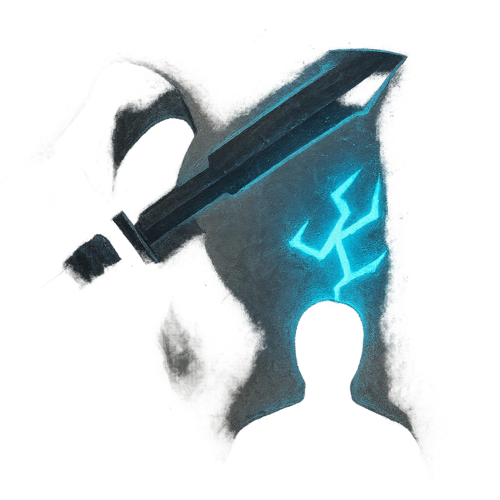

# Judgement

## Description
*
<strong>Spend a Fear</strong> to make a target Guilty in the eyes of the Seraph’s god until the Seraph is defeated. While Guilty, the target doesn’t gain Hope on a result with Hope. When the Seraph succeeds on a standard attack against a Guilty target, they deal Severe damage instead of their standard damage. The Seraph can only mark one target at a time.
*

## Actions
- 
**Make Guilty** *Spend a Fear to make a target Guilty in the eyes of the Seraph’s god until the Seraph is defeated. While Guilty, the target doesn’t gain Hope on a result with Hope. When the Seraph succeeds on a standard attack against a Guilty target, they deal Severe damage instead of their standard damage. The Seraph can only mark one target at a time.*

---

adversaries-features/Leader
 
**UUID:** `Compendium.cybermancy.system.judgement`

