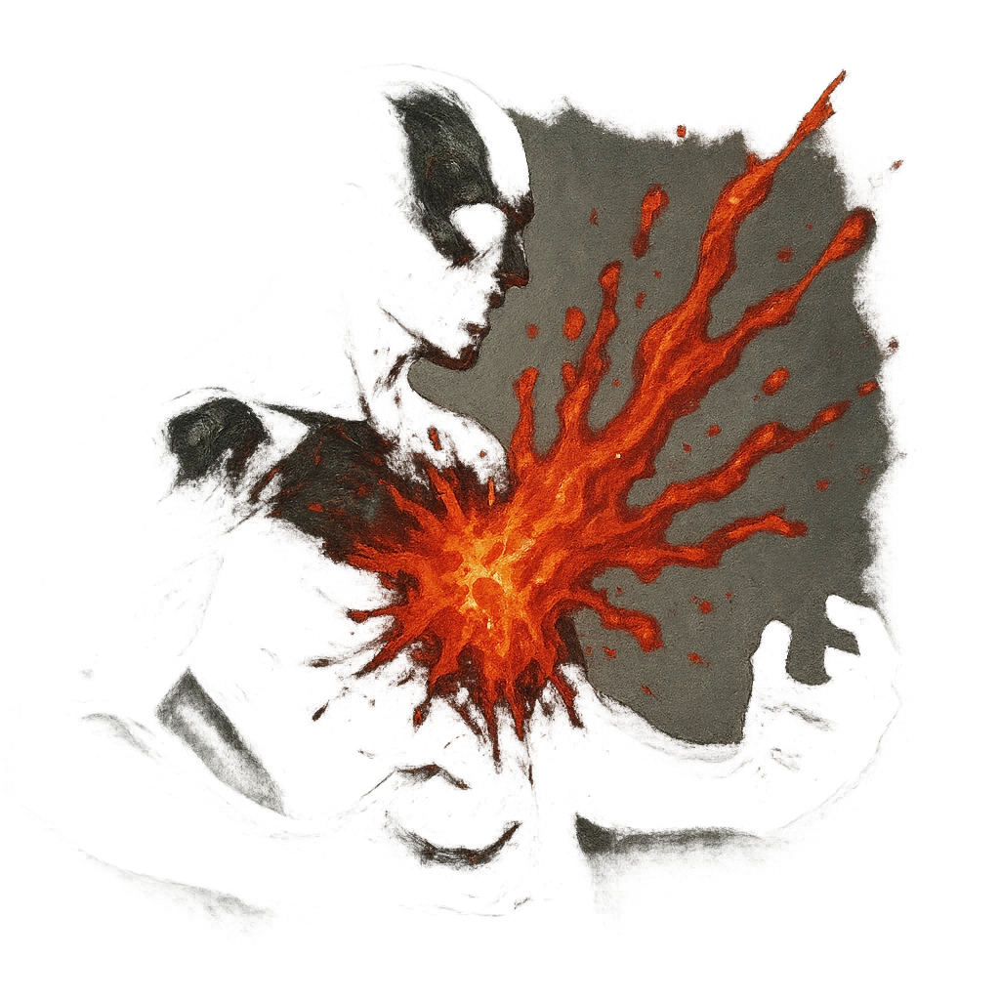

# Lava Splash

## Description
*
When the Molten Scourge takes Severe damage from an attack within Very Close range, molten blood gushes from the wound and deals <strong>2d10+4</strong> direct physical damage to the attacker.
*

## Actions
- 
**Damage** *When the Molten Scourge takes Severe damage from an attack within Very Close range, molten blood gushes from the wound and deals 2d10+4 direct physical damage to the attacker.*

---

adversaries-features/Solo
 
**UUID:** `Compendium.cybermancy.system.lava-splash`

