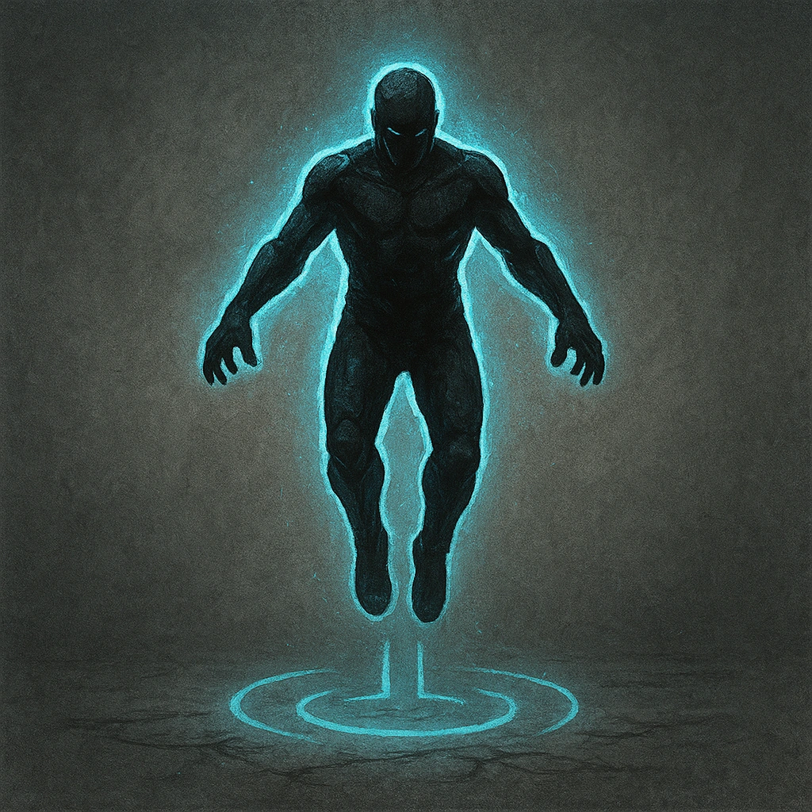

# Levitation

## Description
*
The Skull levitates several feet off the ground and can’t be <em>Restrained</em>.
*

## Actions
—

---

adversaries-features/Ranged
 
**UUID:** `Compendium.cybermancy.system.levitation`

