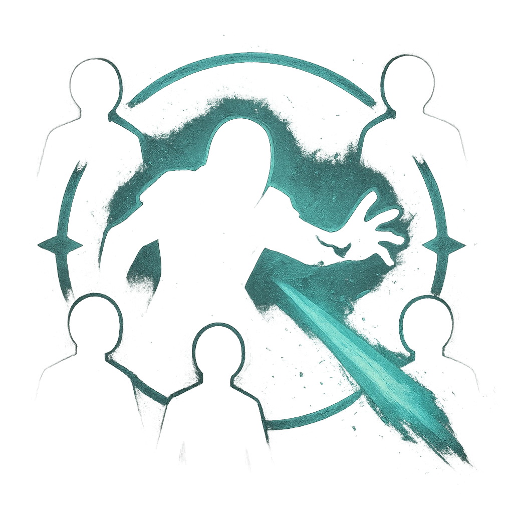

# Lifesuck

## Description
*
When the Vampire is spotlighted, roll a <strong>d8</strong>. On a result of 6 or higher, all targets within Very Close range must mark a HP.

@Template[type:emanation|range:vc]
*

## Actions
- 
**Roll d8** *vc]*

---

adversaries-features/Leader
 
**UUID:** `Compendium.cybermancy.system.lifesuck`

