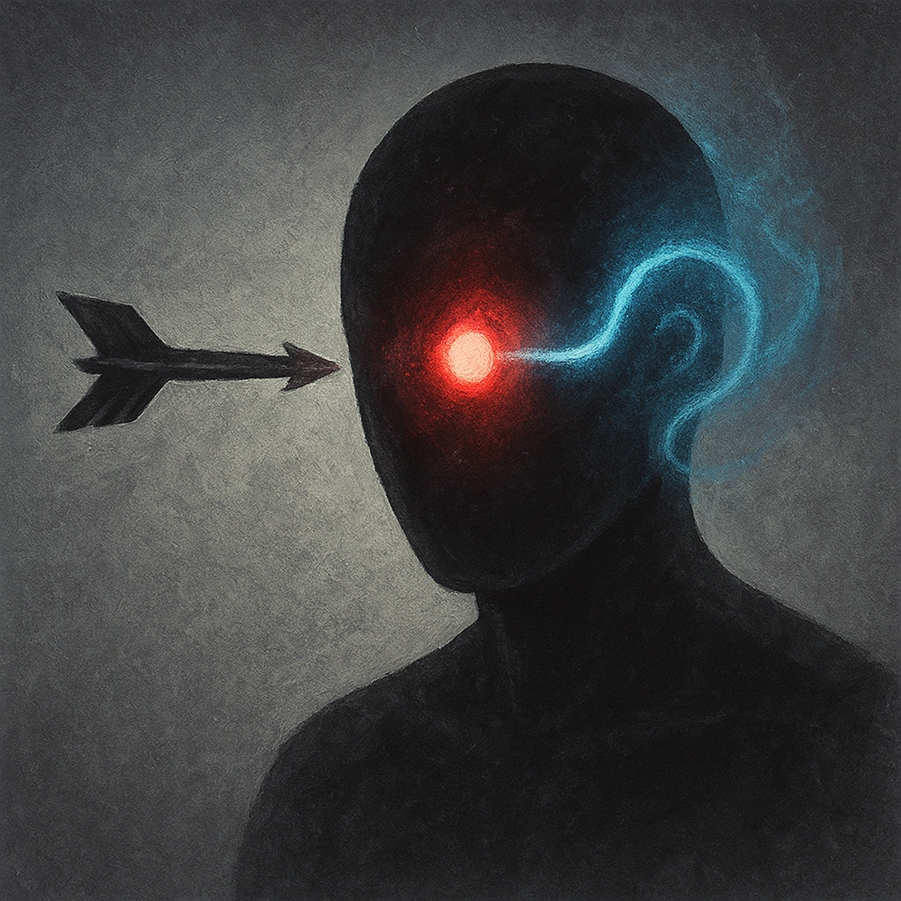

# Look into My Eyes

## Description
*
A creature who moves into Melee range of the Vampire must make an Instinct Reaction Roll. On a failure, you gain <strong>[[/r 1d4]]</strong> Fear.
*

## Actions
- 
**Roll Save** *A creature who moves into Melee range of the Vampire must make an Instinct Reaction Roll. On a failure, you gain [[/r 1d4]] Fear.*

---

adversaries-features/Leader
 
**UUID:** `Compendium.cybermancy.system.look-into-my-eyes`

