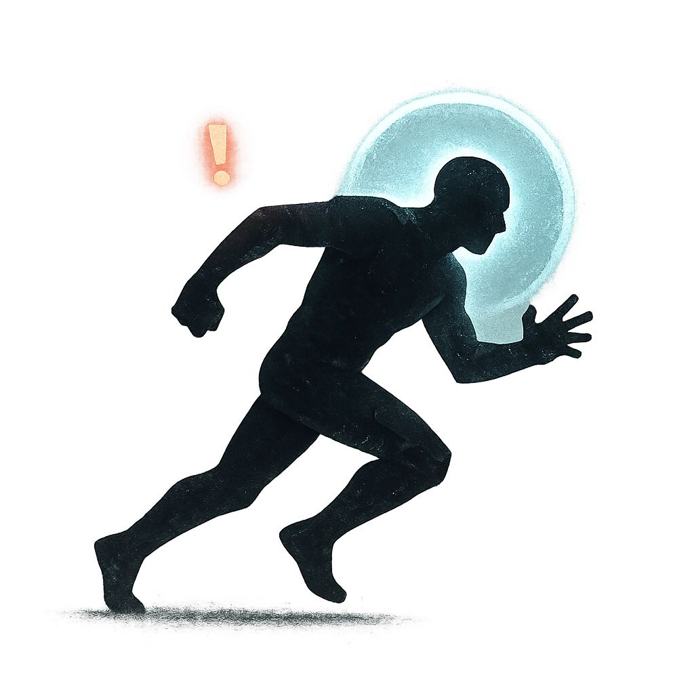

# Lurching Lunge

## Description
*
<strong>Mark a Stress</strong> to spotlight the Experiment as an additional GM move instead of spending Fear.
*

## Actions
- 
**Mark Stress** *Mark a Stress to spotlight the Experiment as an additional GM move instead of spending Fear.*

---

adversaries-features/Standard
 
**UUID:** `Compendium.cybermancy.system.lurching-lunge`

