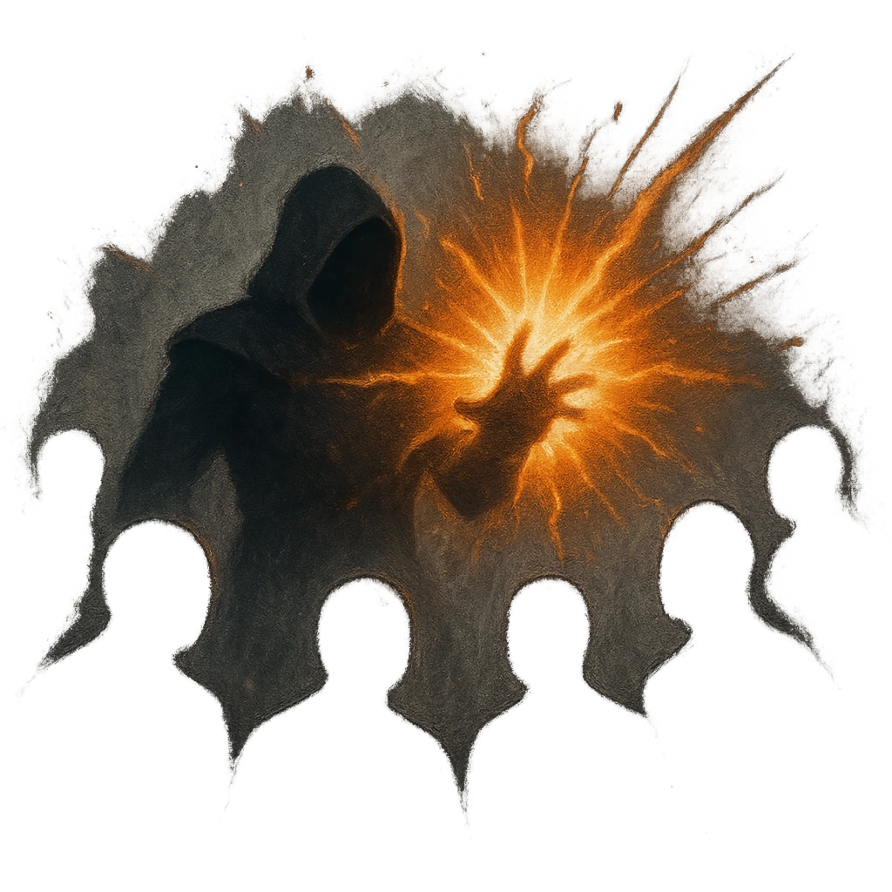

# Magic Burst

## Description
*
<strong>Mark a Stress</strong> to make an attack against all targets within Close range. Targets the Skull succeeds against take <strong>2d6+4</strong> magic damage.

@Template[type:emanation|range:c]
*

## Actions
- 
**Attack** *c]*

---

adversaries-features/Ranged
 
**UUID:** `Compendium.cybermancy.system.magic-burst`

