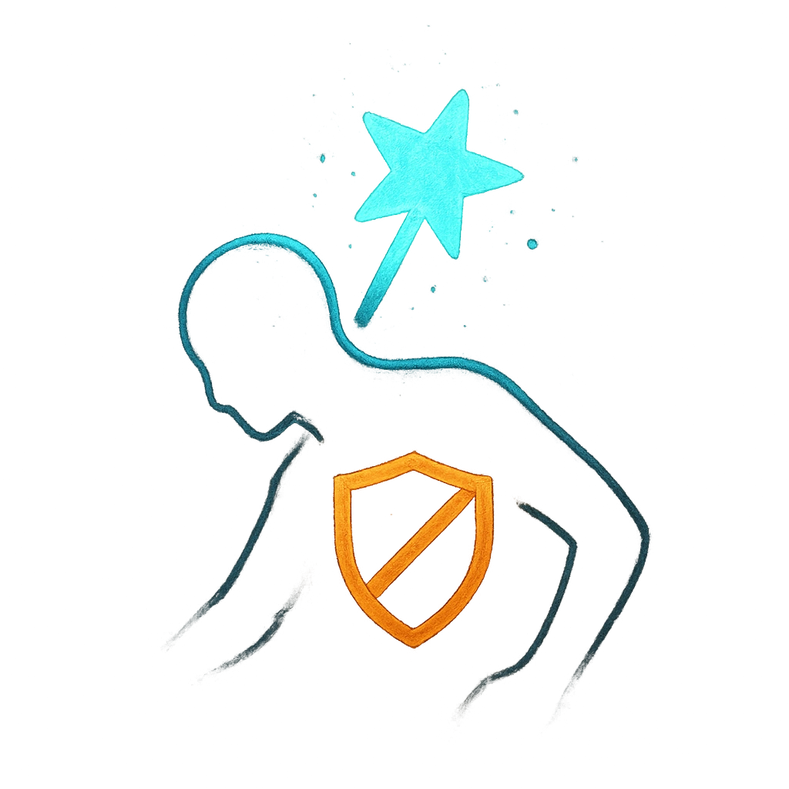

# Magical Weakness

## Description
*
When the Hydra takes magic damage, they become Dazed until the next roll with Fear. While Dazed, they can’t use their Regeneration action but are immune to magic damage.
*

## Actions
- 
**Become Dazed** **

---

adversaries-features/Solo
 
**UUID:** `Compendium.cybermancy.system.magical-weakness`

