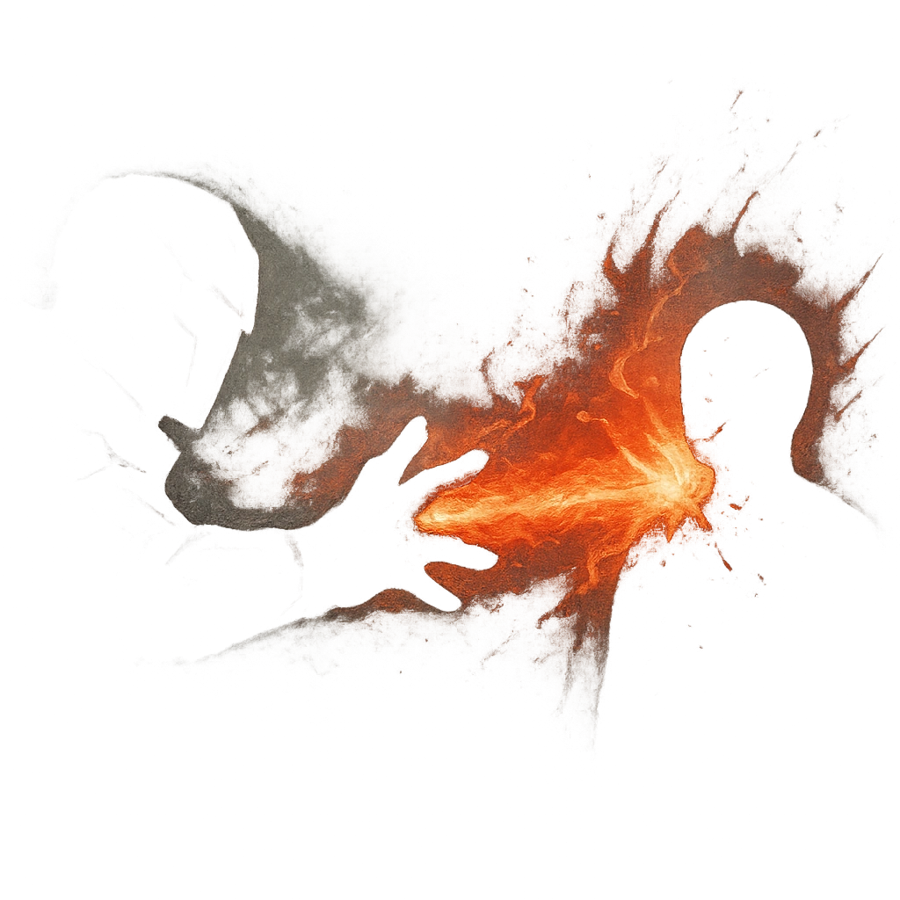

# Mana Beam

## Description
*
The Box fires a searing beam. Make an attack against a target within Far range. On a success, deal <strong>2d10+2</strong> magic damage. 
*

## Actions
- 
**Attack** *The Box fires a searing beam. Make an attack against a target within Far range. On a success, deal 2d10+2 magic damage.*

---

adversaries-features/Solo
 
**UUID:** `Compendium.cybermancy.system.mana-beam`

