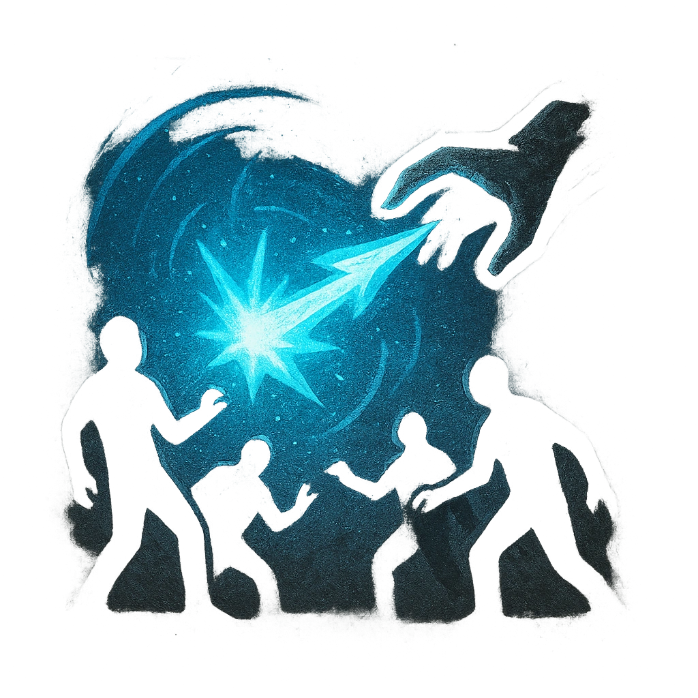

# Mana Bolt

## Description
*
<strong>Spend a Fear</strong> to lob explosive magic at a point within Far range. All targets within Very Close range of that point must make an Agility Reaction Roll. Targets who fail take <strong>2d8+20</strong> magic damage and are knocked back to Close range. Targets who succeed take half damage and aren’t knocked back.

@Template[type:circle|range:vc]
*

## Actions
- 
**Roll Save** *vc]*

---

adversaries-features/Bruiser
 
**UUID:** `Compendium.cybermancy.system.mana-bolt`

