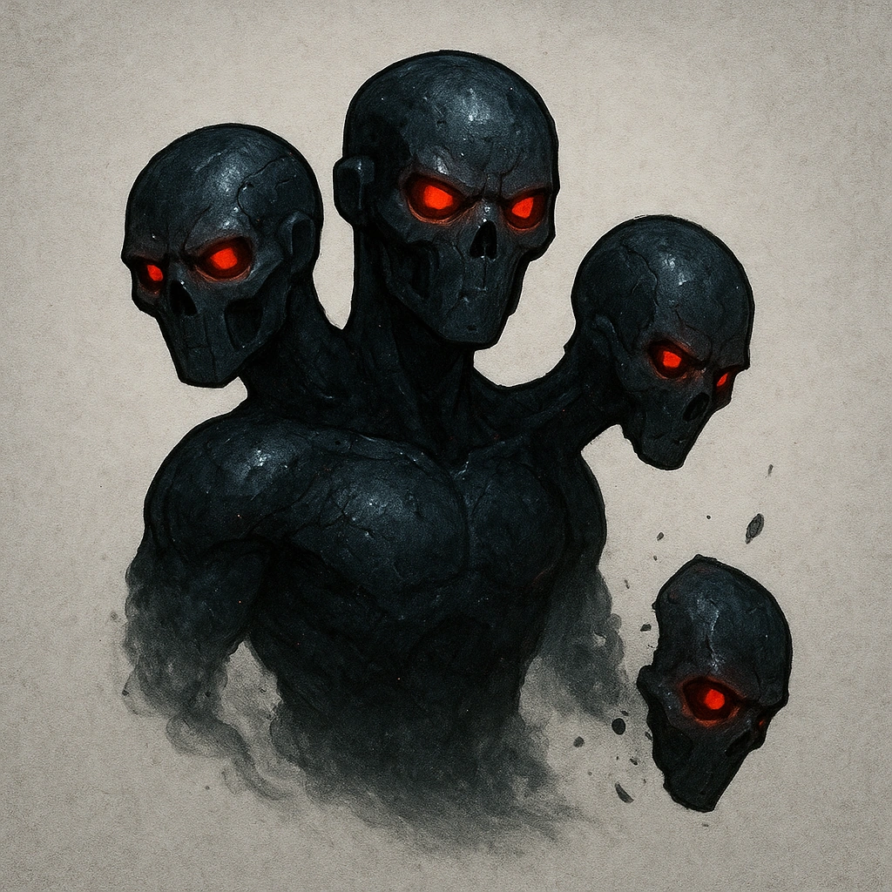

# Many-Headed Menace

## Description
*
The Hydra begins with three heads and can have up to five. When the Hydra takes Major or greater damage, they lose a head.
*

## Actions
—

---

adversaries-features/Solo
 
**UUID:** `Compendium.cybermancy.system.many-headed-menace`

