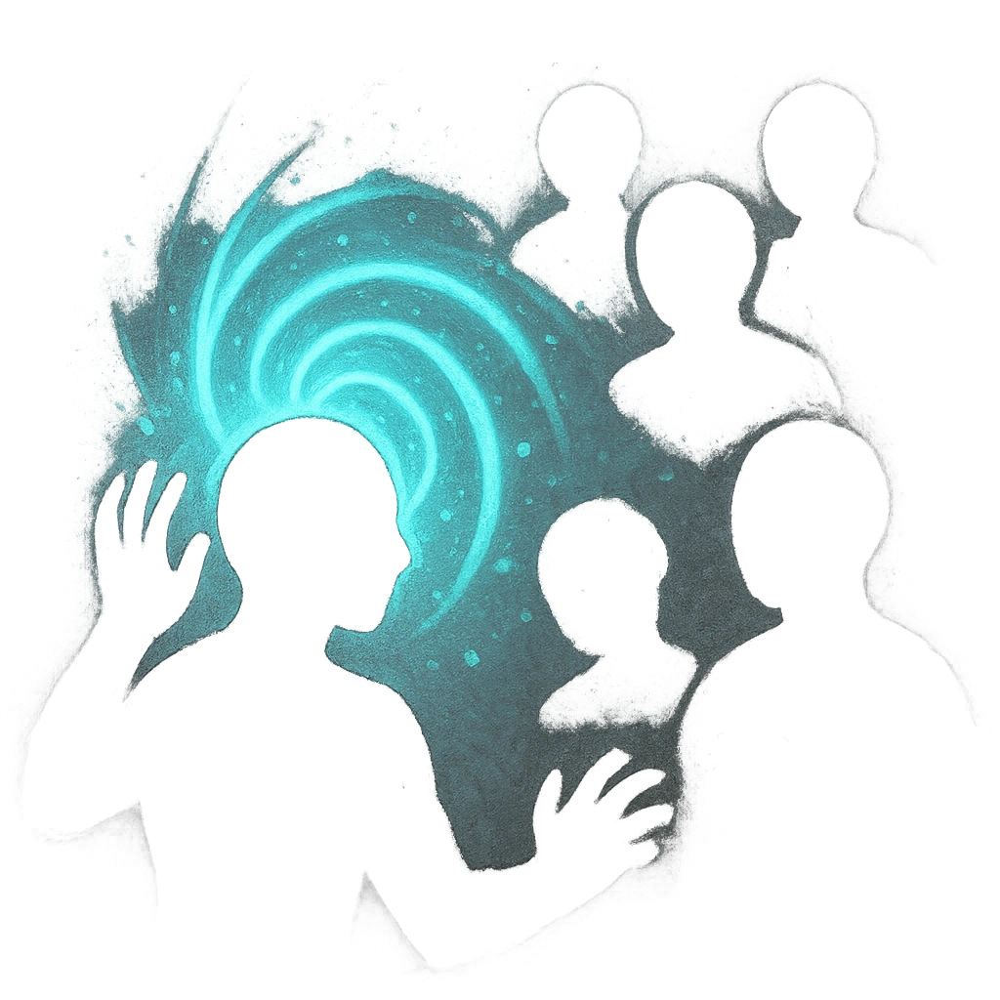

# Mind Dance

## Description
*
<strong>Mark a Stress</strong> to create a magically dazzling display that grapples the minds of nearby foes. All targets within Close range must make an Instinct Reaction Roll. For each target who failed, you gain a Fear and the Flickerfl y learns one of the target’s fears.

@Template[type:emanation|range:c]
*

## Actions
- 
**Roll Save** *c]*

---

adversaries-features/Solo
 
**UUID:** `Compendium.cybermancy.system.mind-dance`

