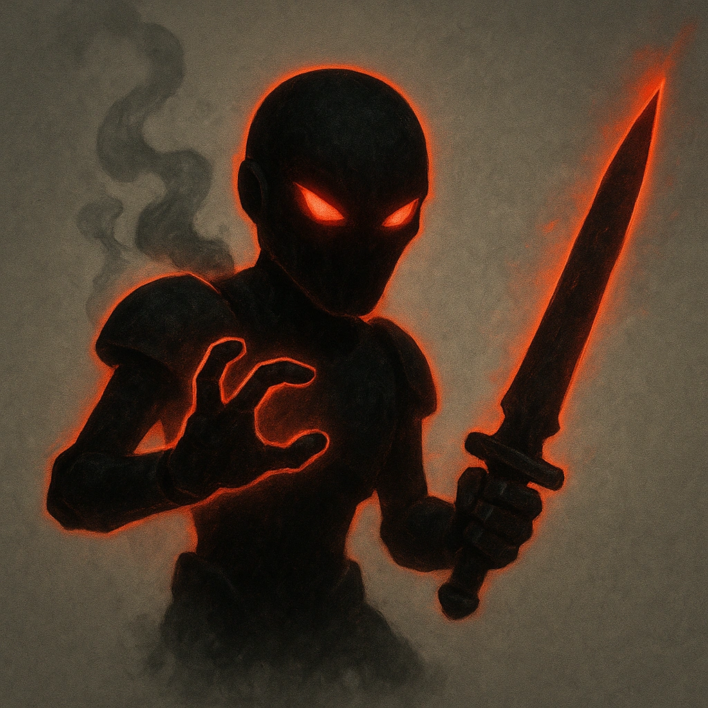

# Minion (5)

## Description
*
The Treant is defeated when they take any damage. For every 5 damage a PC deals to the Treant, defeat an additional Minion within range the attack would succeed against.
*

## Actions
—

---

adversaries-features/Minion
 
**UUID:** `Compendium.cybermancy.system.minion-5`

