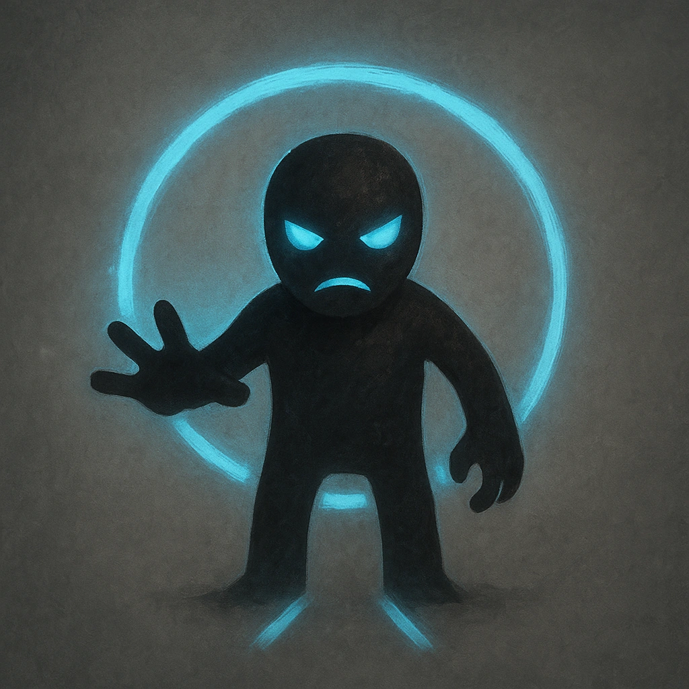

# Minion (9)

## Description
*
The Elemental is defeated when they take any damage. For every 9 damage a PC deals to the Elemental, defeat an additional Minion within range the attack would succeed against.
*

## Actions
—

---

adversaries-features/Minion
 
**UUID:** `Compendium.cybermancy.system.minion-9`

