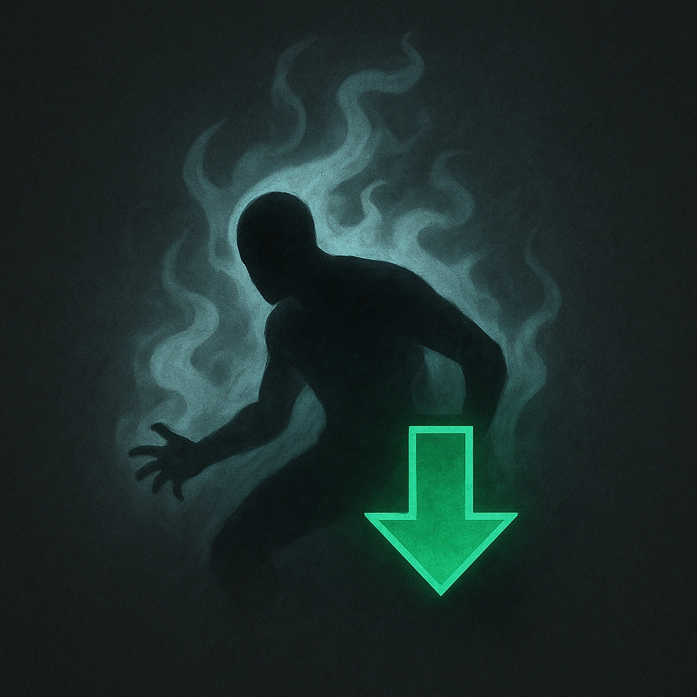

# Mistform

## Description
*
When the Vampire takes physical damage, you can <strong>spend a Fear</strong> to take half damage.
*

## Actions
- 
**Spend Fear** *When the Vampire takes physical damage, you can spend a Fear to take half damage.*

---

adversaries-features/Standard
 
**UUID:** `Compendium.cybermancy.system.mistform`

