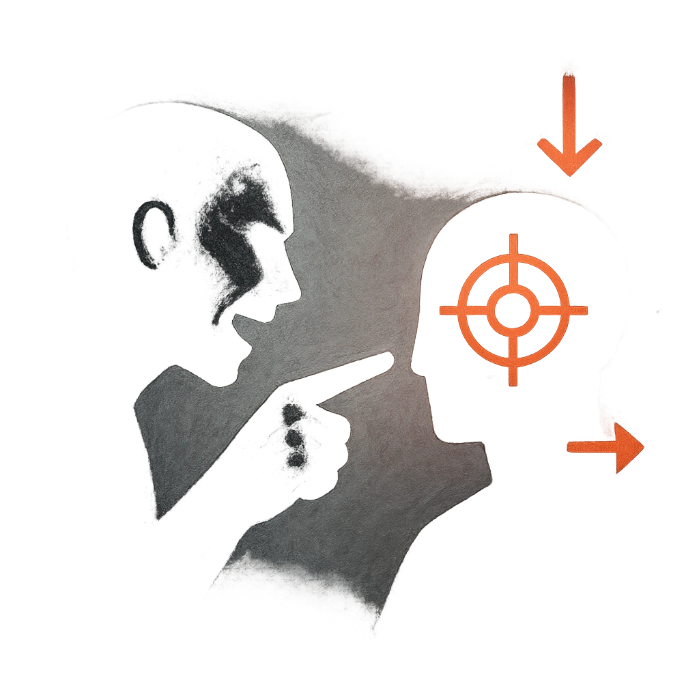

# Mockery

## Description
*
<strong>Mark a Stress</strong> to say something mocking and force a target within Close range to make a Presence Reaction Roll (14) to see if they can save face. On a failure, the target must mark 2 Stress and is Vulnerable until the scene ends.
*

## Actions
- 
**Use** *Mark a Stress to say something mocking and force a target within Close range to make a Presence Reaction Roll (14) to see if they can save face. On a failure, the target must mark 2 Stress and is Vulnerable until the scene ends.*

---

adversaries-features/Social
 
**UUID:** `Compendium.cybermancy.system.mockery`

