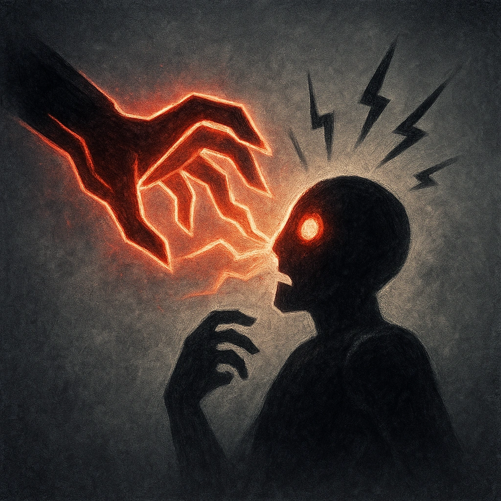

# Momentum

## Description
*
 When the Elemental makes a successful attack against a PC, you gain a Fear.
*

## Actions
—

---

adversaries-features/Solo
 
**UUID:** `Compendium.cybermancy.system.momentum`

