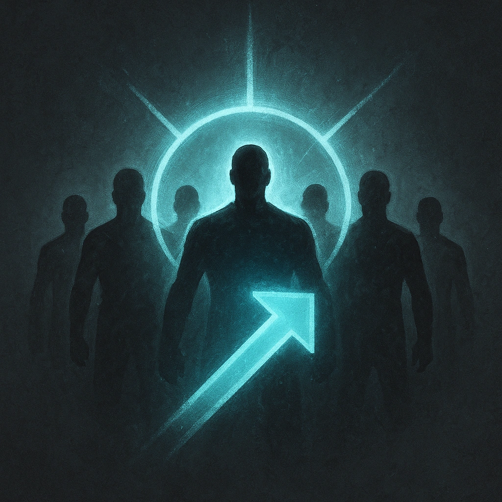

# Move as a Unit

## Description
*
<strong>Spend 2 Fear</strong> to spotlight up to fi ve allies within Far range.
*

## Actions
- 
**Spend Fear** *Spend 2 Fear to spotlight up to fi ve allies within Far range.*

---

adversaries-features/Leader
 
**UUID:** `Compendium.cybermancy.system.move-as-a-unit`

