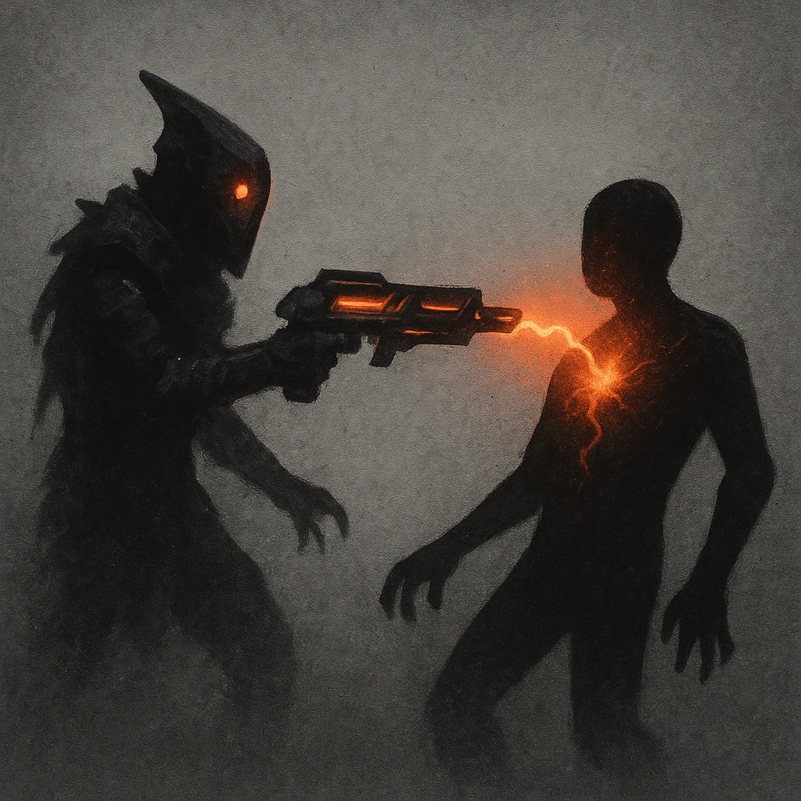

# My Turn

## Description
*
When the Demon marks HP from an attack, <strong>spend a number of Fear equal to the HP marked by the Demon</strong> to cause the attacker to mark the same number of HP.
*

## Actions
—

---

adversaries-features/Ranged
 
**UUID:** `Compendium.cybermancy.system.my-turn`

