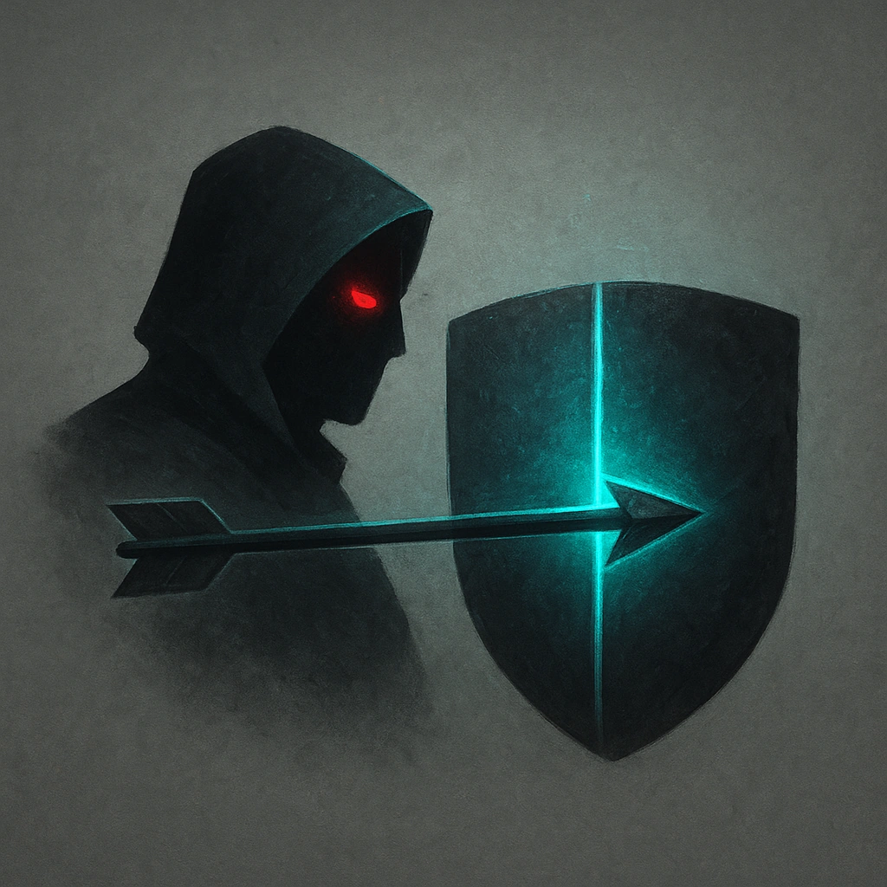

# Never Misses

## Description
*
When the Flickerfly makes an attack, the target’s Evasion is halved against the attack.
*

## Actions
- 
**Halve Evasion** *When the Flickerfly makes an attack, the target’s Evasion is halved against the attack.*

---

adversaries-features/Solo
 
**UUID:** `Compendium.cybermancy.system.never-misses`

