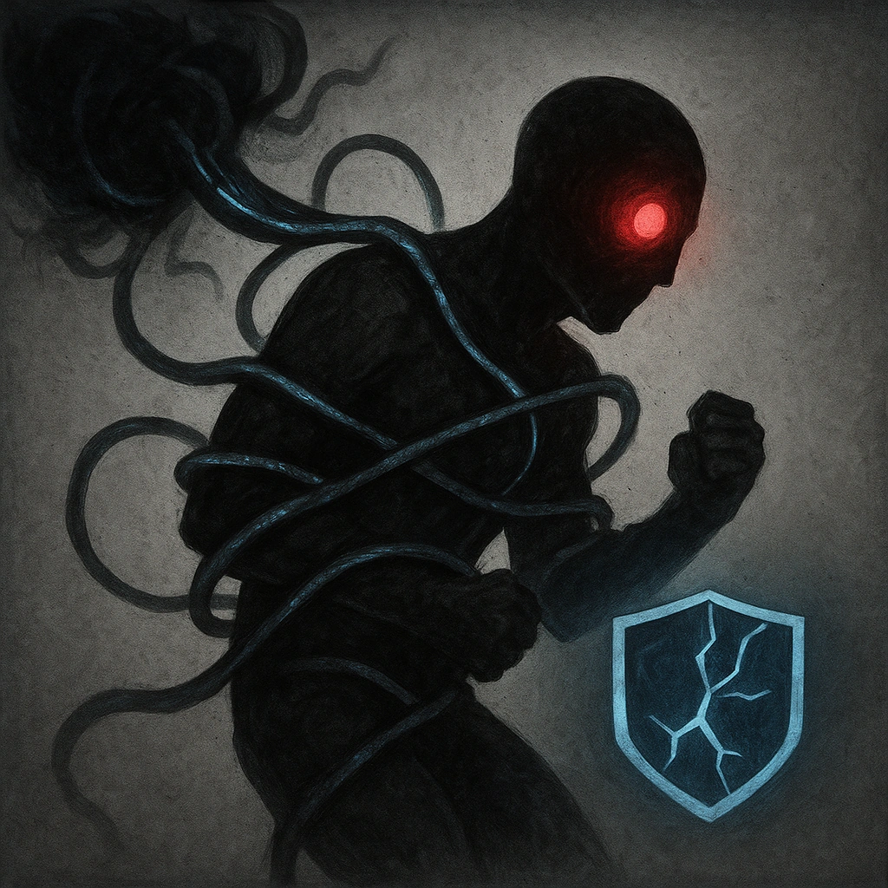

# Nightmare Tableau

## Description
*
<strong>Mark a Stress</strong> to trap a target within Far range in a powerful illusion of their worst fears. While trapped, the target is <em>Restrained</em> and <em>Vulnerable</em> until they break free, ending both conditions, with a successful Instinct Roll.
*

## Actions
- 
**Generic** *Mark a Stress to trap a target within Far range in a powerful illusion of their worst fears. While trapped, the target is Restrained and Vulnerable until they break free, ending both conditions, with a successful Instinct Roll.*

---

adversaries-features/Support
 
**UUID:** `Compendium.cybermancy.system.nightmare-tableau`

