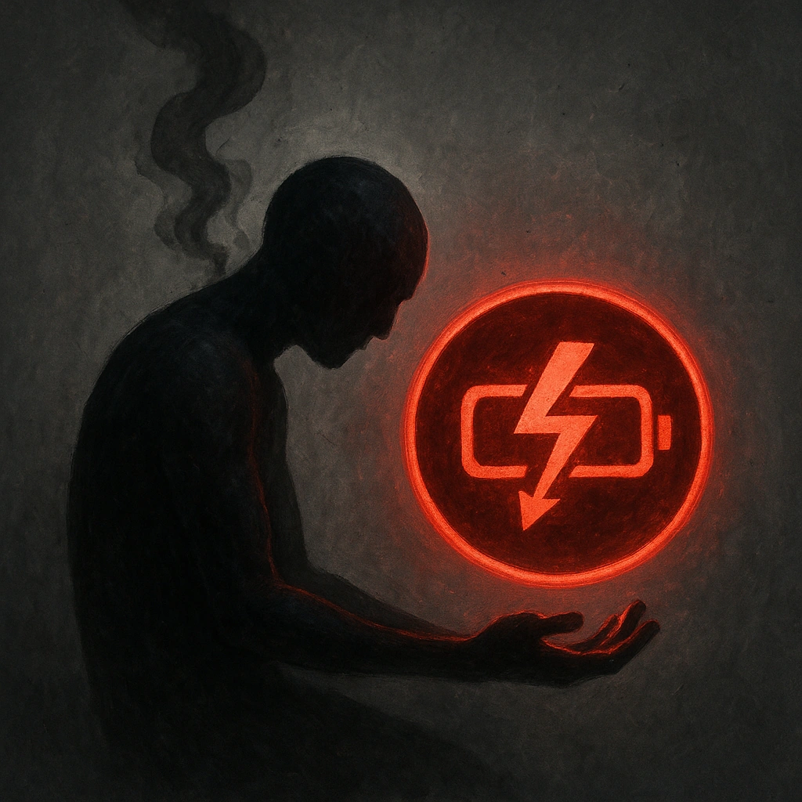

# No Hope

## Description
*
When a PC rolls with Fear while within Far range of the Dragon, they lose a Hope.
*

## Actions
—

---

adversaries-features/Solo
 
**UUID:** `Compendium.cybermancy.system.no-hope`

