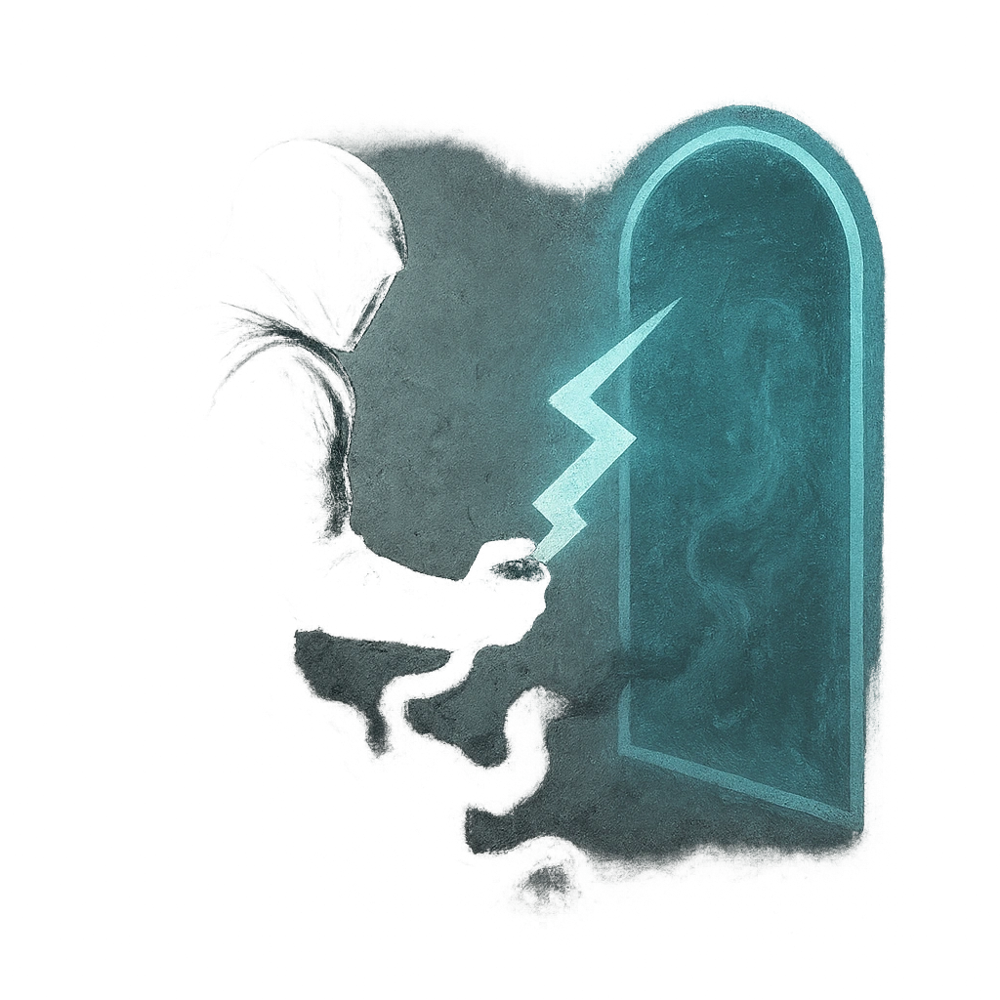

# Not Today, My Dears

## Description
*
When the Necromancer has marked 7 or more of their HP, you can <strong>spend a Fear</strong> to have them teleport away to a safe location to recover. A PC who succeeds on an Instinct Roll can trace the teleportation magic to their destination.
*

## Actions
- 
**Roll Save** *When the Necromancer has marked 7 or more of their HP, you can spend a Fear to have them teleport away to a safe location to recover. A PC who succeeds on an Instinct Roll can trace the teleportation magic to their destination.*

---

adversaries-features/Leader
 
**UUID:** `Compendium.cybermancy.system.not-today-my-dears`

