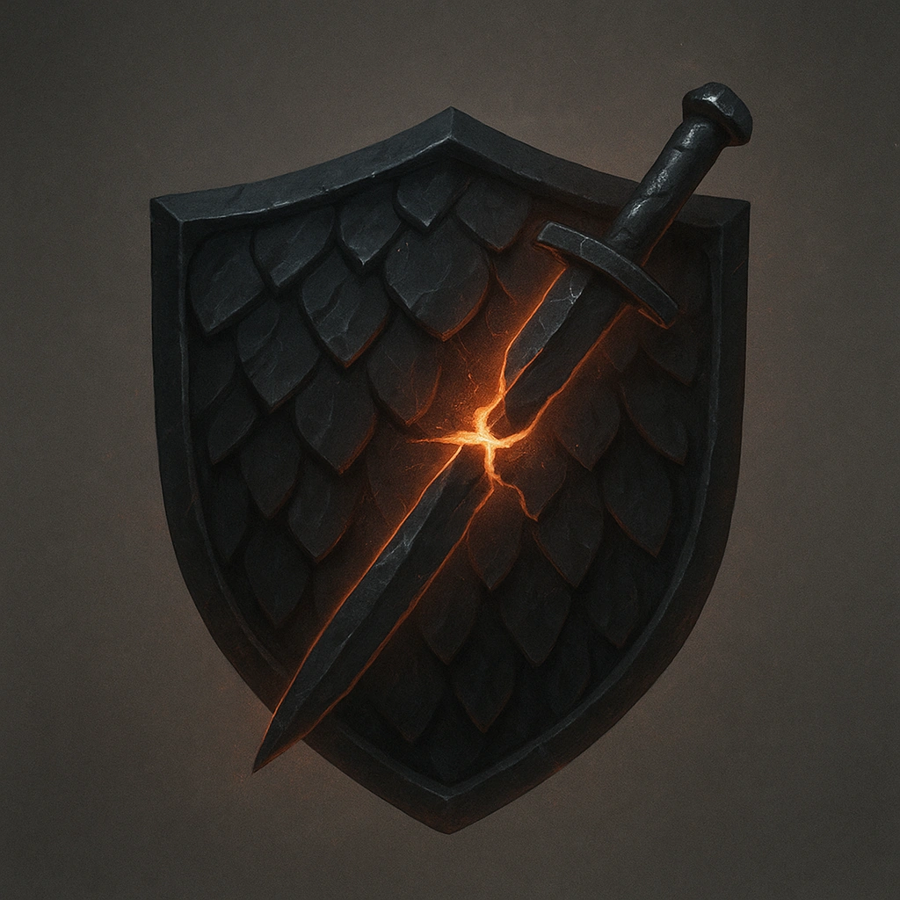

# Obsidian Scales

## Description
*
The Obsidian Predator is resistant to physical damage.
*

## Actions
—

---

adversaries-features/Solo
 
**UUID:** `Compendium.cybermancy.system.obsidian-scales`

