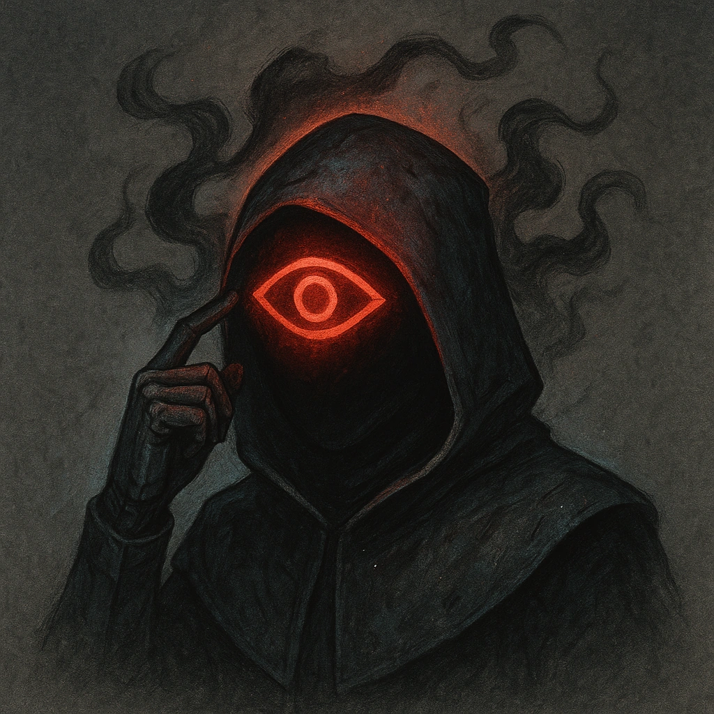

# Ominous Knowledge

## Description
*
When the Oracle sees a mortal creature, they instantly know one of their personal nightmares.
*

## Actions
—

---

adversaries-features/Solo
 
**UUID:** `Compendium.cybermancy.system.ominous-knowledge`

