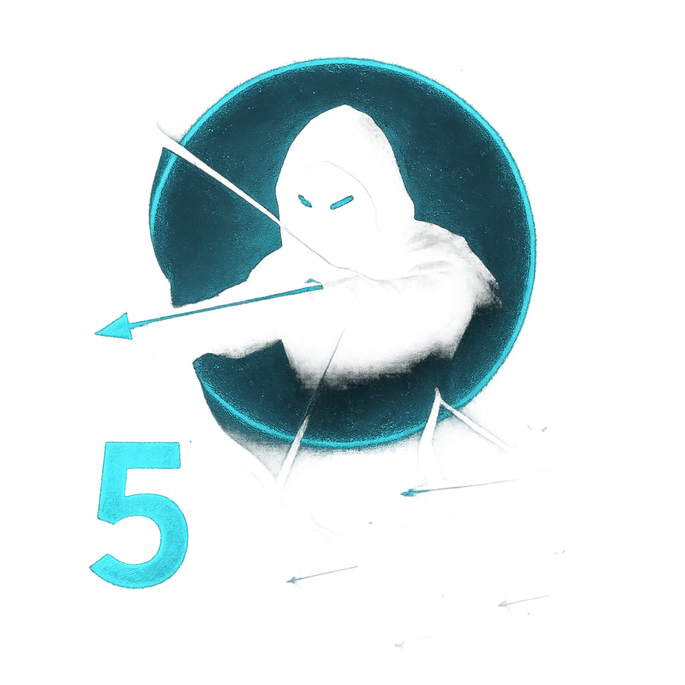

# On My Signal

## Description
*
Countdown (5). When the Head Guard is in the spotlight for the fi rst time, activate the countdown. It ticks down when a PC makes an attack roll. When it triggers, all Archer Guards within Far range make a standard attack with advantage against the nearest target within their range. If any attacks succeed on the same target, combine their damage.

@Template[type:emanation|range:f]
*

## Actions
—

---

adversaries-features/Leader
 
**UUID:** `Compendium.cybermancy.system.on-my-signal`

