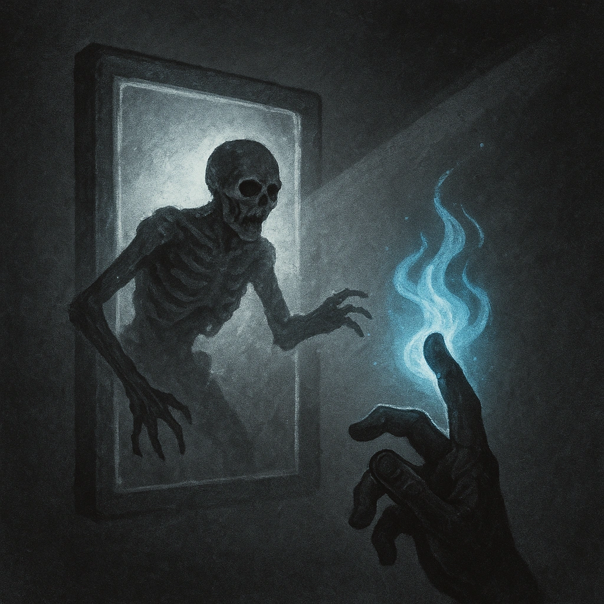

# Open the Gates of Death

## Description
*
<strong>Spend a Fear</strong> to summon a @UUID[Compendium.daggerheart.adversaries.Actor.YhJrP7rTBiRdX5Fp]{Zombie Legion}, which appears at Close range and immediately takes the spotlight.
*

## Actions
- 
**Spend Fear** *Spend a Fear to summon a @UUID[Compendium.daggerheart.adversaries.Actor.YhJrP7rTBiRdX5Fp]{Zombie Legion}, which appears at Close range and immediately takes the spotlight.*

---

adversaries-features/Leader
 
**UUID:** `Compendium.cybermancy.system.open-the-gates-of-death`

