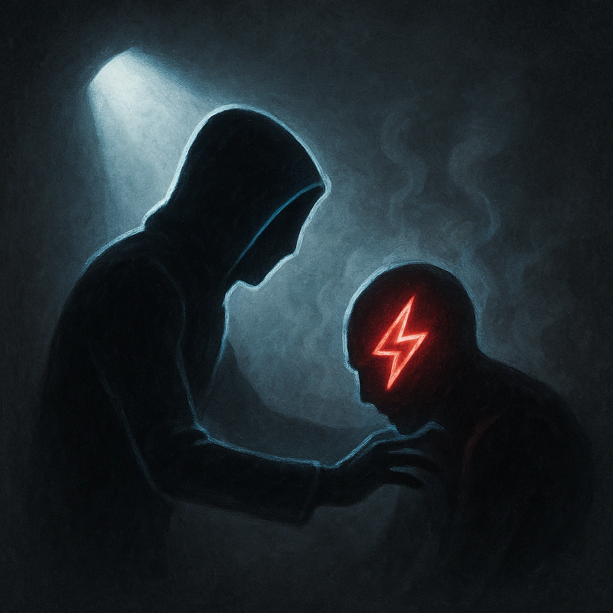

# Our Master's Will

## Description
*
When you spotlight an ally within Far range, <strong>mark a Stress</strong> to gain a Fear.
*

## Actions
- 
**Mark Stress** *When you spotlight an ally within Far range, mark a Stress to gain a Fear.*

---

adversaries-features/Leader
 
**UUID:** `Compendium.cybermancy.system.our-master-s-will`

