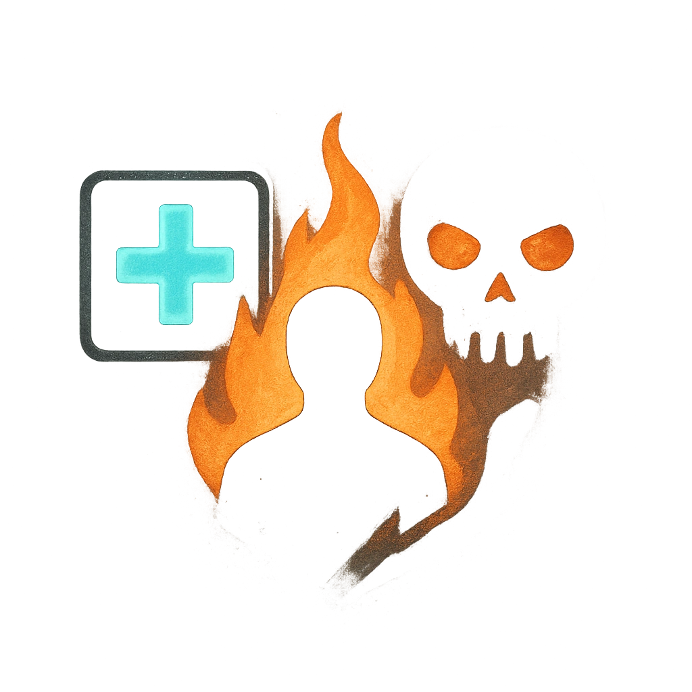

# Overcharge

## Description
*
Before rolling damage for the Box’s attack, you can <strong>mark a Stress</strong> to add a <strong>d6</strong> to the damage roll. Additionally, you gain a Fear.
*

## Actions
- 
**Mark Stress** *Before rolling damage for the Box’s attack, you can mark a Stress to add a d6 to the damage roll. Additionally, you gain a Fear.*

---

adversaries-features/Solo
 
**UUID:** `Compendium.cybermancy.system.overcharge`

