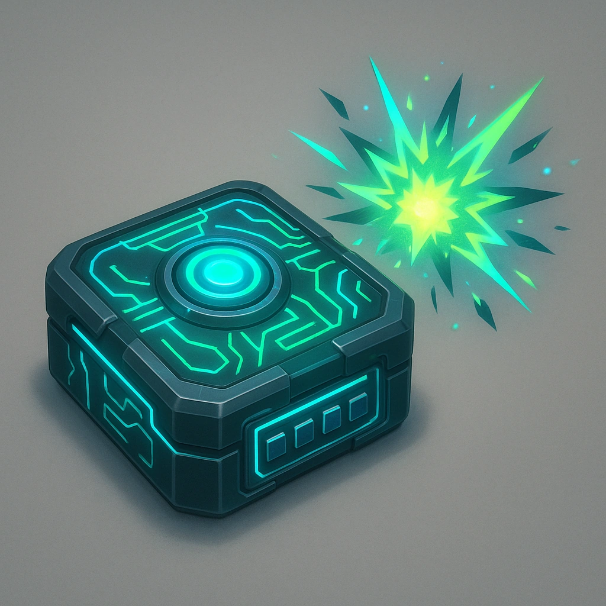

# Overload

## Description
*
Before rolling damage for the Construct’s attack, you can <strong>mark a Stress</strong> to gain a +10 bonus to the damage roll. The Construct can then take the spotlight again.
*

## Actions
- 
**Mark Stress** *Before rolling damage for the Construct’s attack, you can mark a Stress to gain a +10 bonus to the damage roll. The Construct can then take the spotlight again.*

---

adversaries-features/Solo
 
**UUID:** `Compendium.cybermancy.system.overload`

