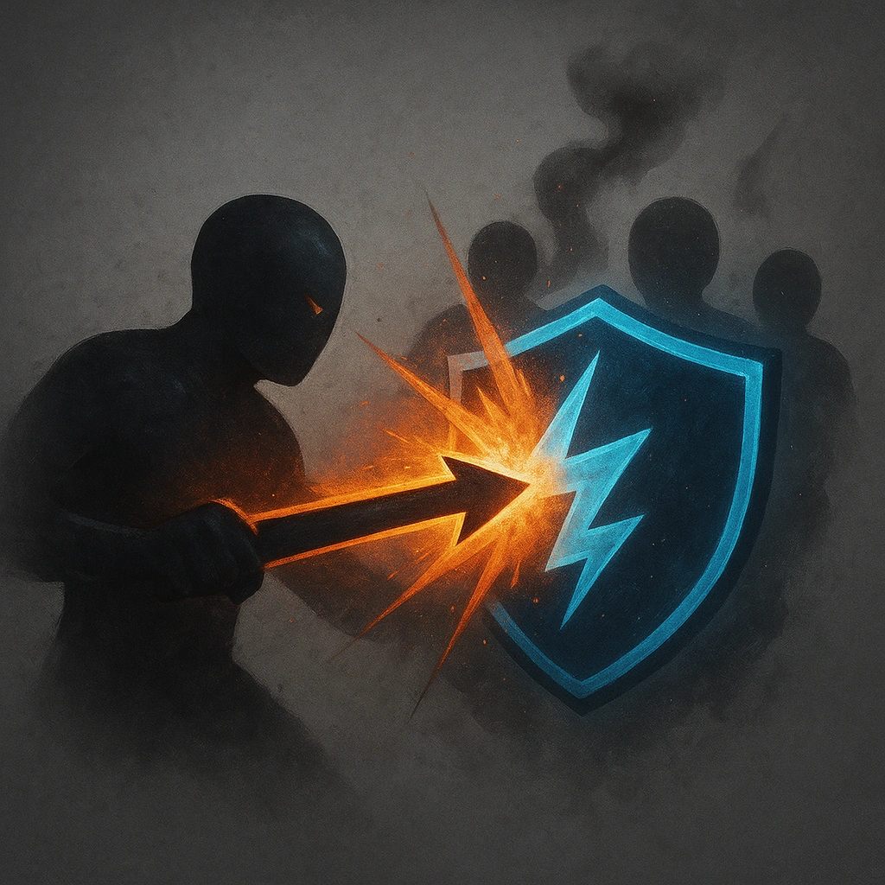

# Overwhelm

## Description
*
When the Zombies mark HP from an attack within Melee range, you can <strong>mark a Stress</strong> to make a standard attack against the attacker.
*

## Actions
- 
**Mark Stress** *When the Zombies mark HP from an attack within Melee range, you can mark a Stress to make a standard attack against the attacker.*

---

adversaries-features/Horde
 
**UUID:** `Compendium.cybermancy.system.overwhelm`

