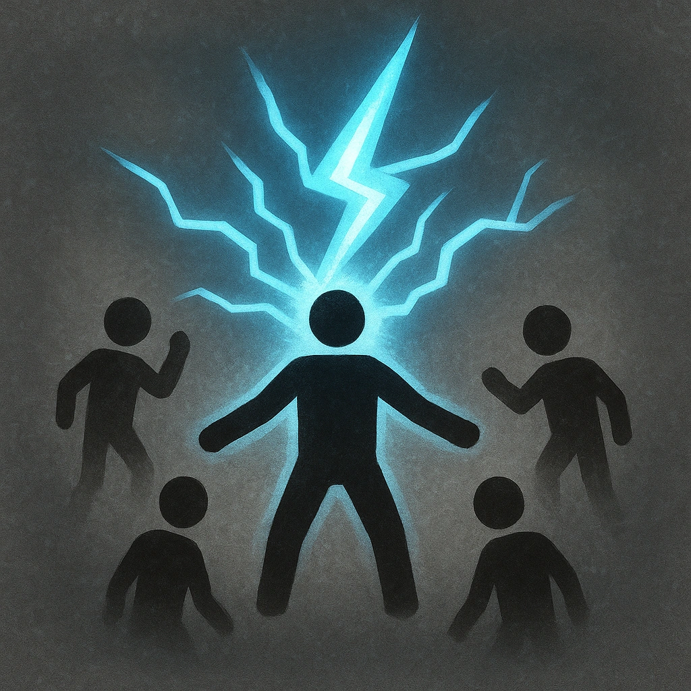

# Paralyzing Shock

## Description
*
<strong>Mark a Stress</strong> to make a standard attack against all targets within Very Close range. You gain a Fear for each target that marks HP.
*

## Actions
- 
**Attack** *Mark a Stress to make a standard attack against all targets within Very Close range. You gain a Fear for each target that marks HP.*

---

adversaries-features/Horde
 
**UUID:** `Compendium.cybermancy.system.paralyzing-shock`

