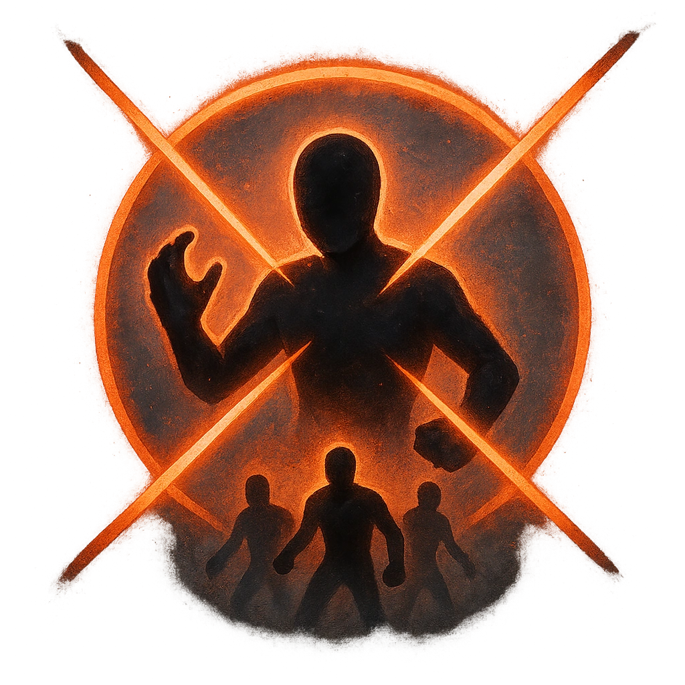

# Perfect Strike

## Description
*
<strong>Mark a Stress </strong>to make a standard attack against all targets within Very Close range. Targets the Zombie succeeds against are <em>Vulnerable</em> until their next rest.

@Template[type:emanation|range:vc]
*

## Actions
- 
**Attack** *vc]*

---

adversaries-features/Bruiser
 
**UUID:** `Compendium.cybermancy.system.perfect-strike`

