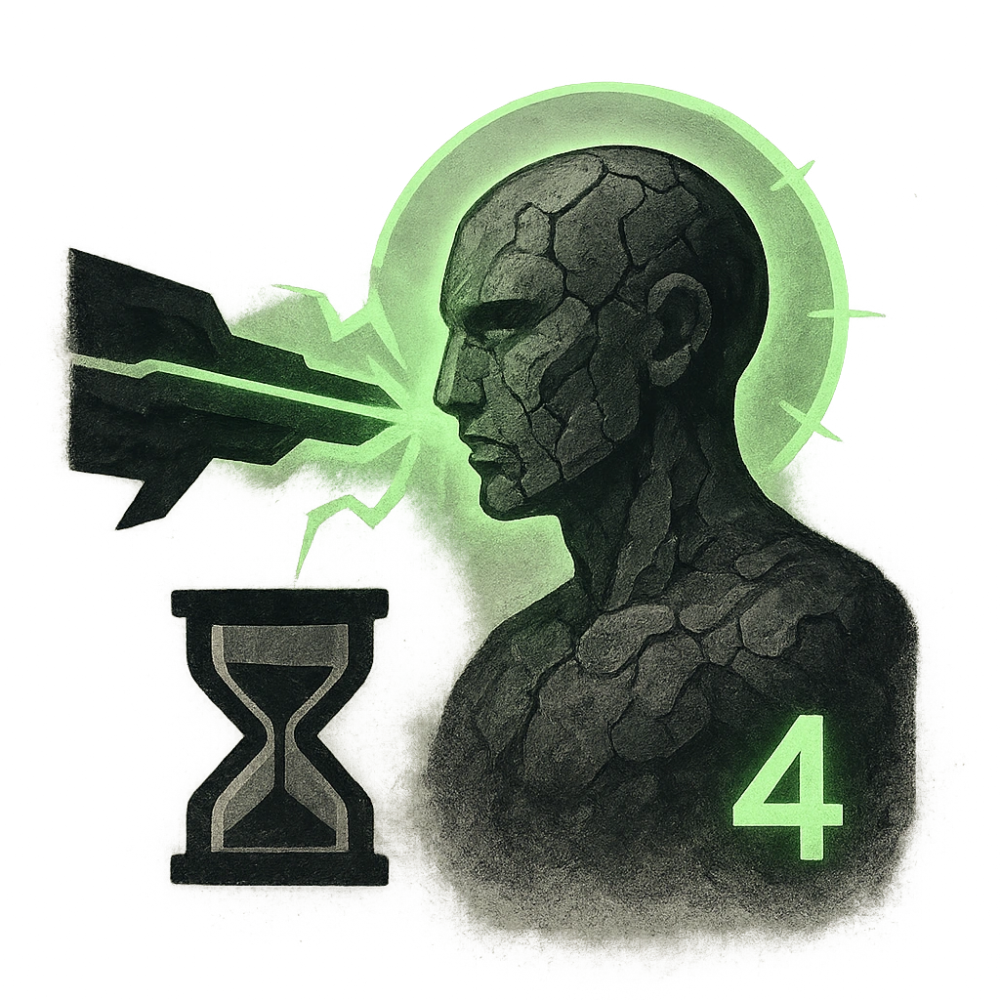

# Petrifying Gaze

## Description
*
When the Gorgon takes damage from an attack within Close range, you can <strong>spend a Fear</strong> to force the attacker to make an Instinct Reaction Roll. On a failure, they begin to turn to stone, marking a HP and starting a Petrification Countdown (4). This countdown ticks down when the Gorgon is attacked. When it triggers, the target must make a death move. If the Gorgon is defeated, all petrification countdowns end.
*

## Actions
- 
**Spend Fear** *When the Gorgon takes damage from an attack within Close range, you can spend a Fear to force the attacker to make an Instinct Reaction Roll. On a failure, they begin to turn to stone, marking a HP and starting a Petrification Countdown (4). This countdown ticks down when the Gorgon is attacked. When it triggers, the target must make a death move. If the Gorgon is defeated, all petrification countdowns end.*

---

adversaries-features/Solo
 
**UUID:** `Compendium.cybermancy.system.petrifying-gaze`

