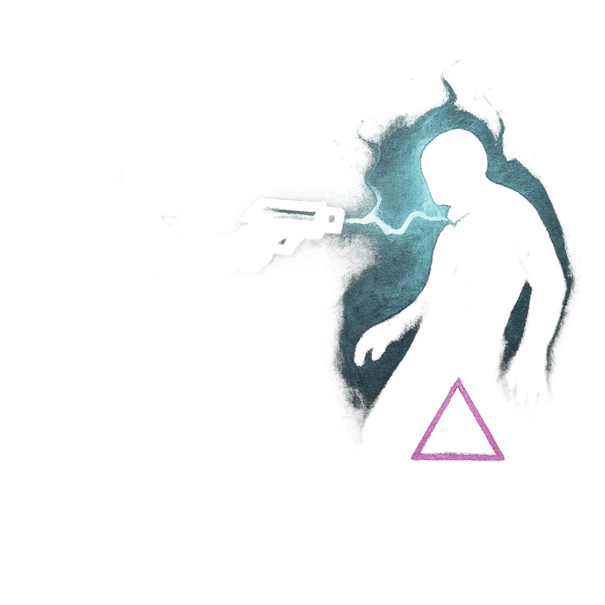

# Pick Off the Straggler

## Description
*
<strong>Mark a Stress</strong> to cause a target within Melee range to make an Instinct Reaction Roll. On a failure, the target must mark 2 Stress and is teleported with the Fang to a shadow within Far range, making them temporarily Vulnerable. On a success, the target must mark a Stress.
*

## Actions
- 
**Roll Save** *Mark a Stress to cause a target within Melee range to make an Instinct Reaction Roll. On a failure, the target must mark 2 Stress and is teleported with the Fang to a shadow within Far range, making them temporarily Vulnerable. On a success, the target must mark a Stress.*

---

adversaries-features/Skulk
 
**UUID:** `Compendium.cybermancy.system.pick-off-the-straggler`

