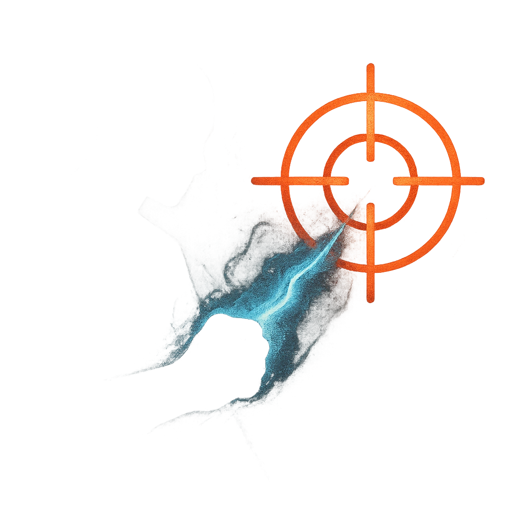

# Pick Your Target

## Description
*
<strong>Spend a Fear</strong> to make an attack within Far range against a PC who is within Very Close range of at least two other PCs. On a success, the target takes <strong>2d8+12</strong> physical damage.
*

## Actions
- 
**Attack** *Spend a Fear to make an attack within Far range against a PC who is within Very Close range of at least two other PCs. On a success, the target takes 2d8+12 physical damage.*

---

adversaries-features/Ranged
 
**UUID:** `Compendium.cybermancy.system.pick-your-target`

