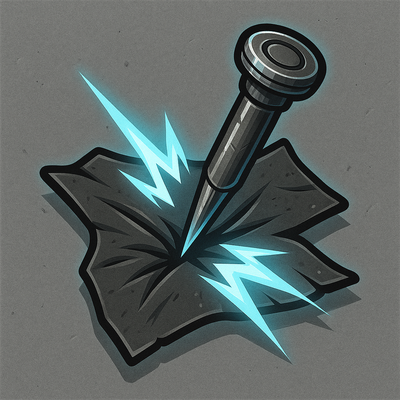

# Pinning Strike

## Description
*
Make a standard attack against a target. On a success, you can <strong>mark a Stress</strong> to pin them to a nearby surface. The pinned target is <em>Restrained</em> until they break free with a successful Finesse or Strength Roll.
*

## Actions
- 
**Attack** *Make a standard attack against a target. On a success, you can mark a Stress to pin them to a nearby surface. The pinned target is Restrained until they break free with a successful Finesse or Strength Roll.*

---

adversaries-features/Leader
 
**UUID:** `Compendium.cybermancy.system.pinning-strike`

