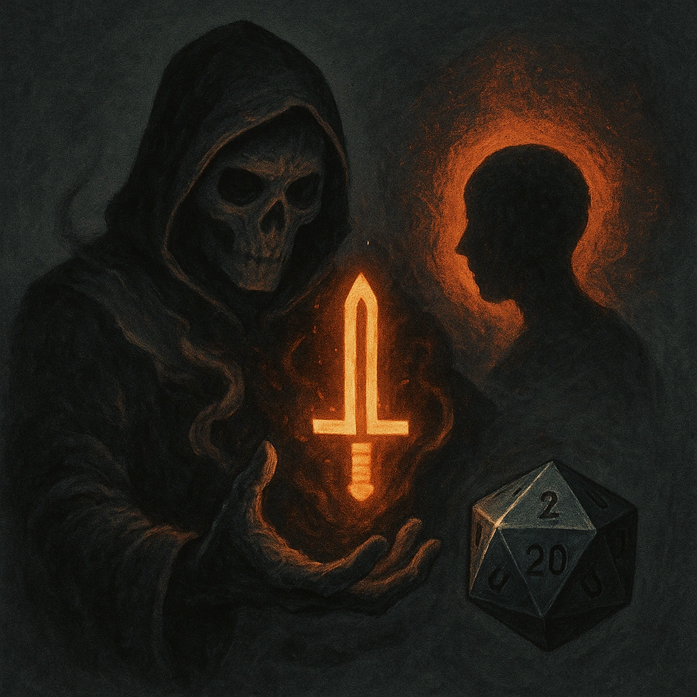

# Pronounce Fate

## Description
*
<strong>Spend a Fear</strong> to present a target within Far range with a vision of their personal nightmare. The target must make a Knowledge Reaction Roll. On a failure, they lose all Hope and take <strong>2d20+4</strong> direct magic damage. On a success, they take half damage and lose a Hope.
*

## Actions
- 
**Roll Save** *Spend a Fear to present a target within Far range with a vision of their personal nightmare. The target must make a Knowledge Reaction Roll. On a failure, they lose all Hope and take 2d20+4 direct magic damage. On a success, they take half damage and lose a Hope.*

---

adversaries-features/Solo
 
**UUID:** `Compendium.cybermancy.system.pronounce-fate`

