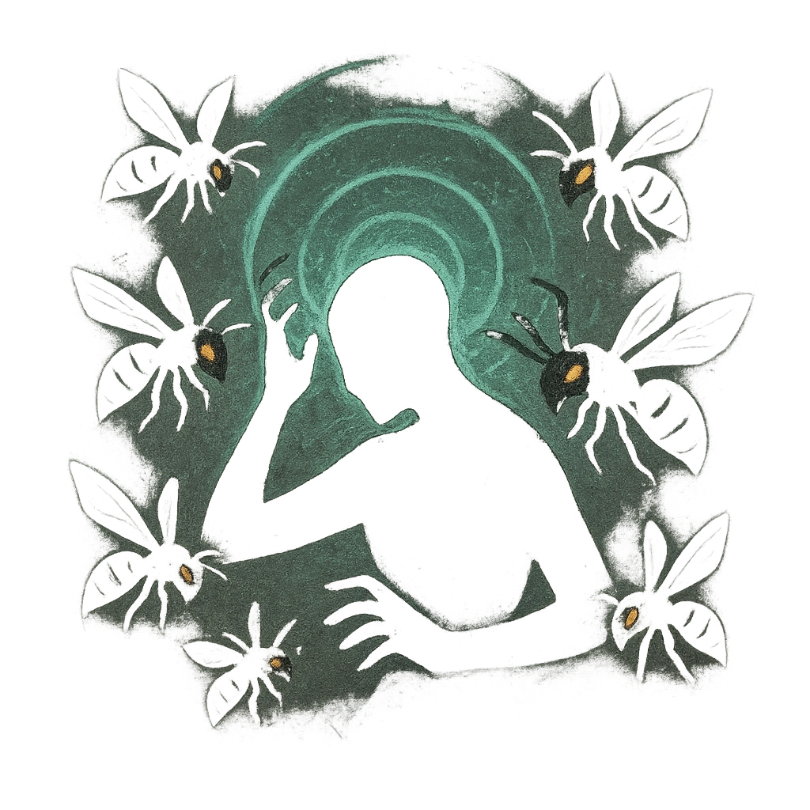

# Psionic Whine

## Description
*
The Box releases a cluster of mechanical bees whose buzz rattles mortal minds. All targets within Close range must succeed on a Presence Reaction Roll or take <strong>2d4+9</strong> direct magic damage.

@Template[type:emanation|range:c]
*

## Actions
- 
**Bees!** *c]*

---

adversaries-features/Solo
 
**UUID:** `Compendium.cybermancy.system.psionic-whine`

