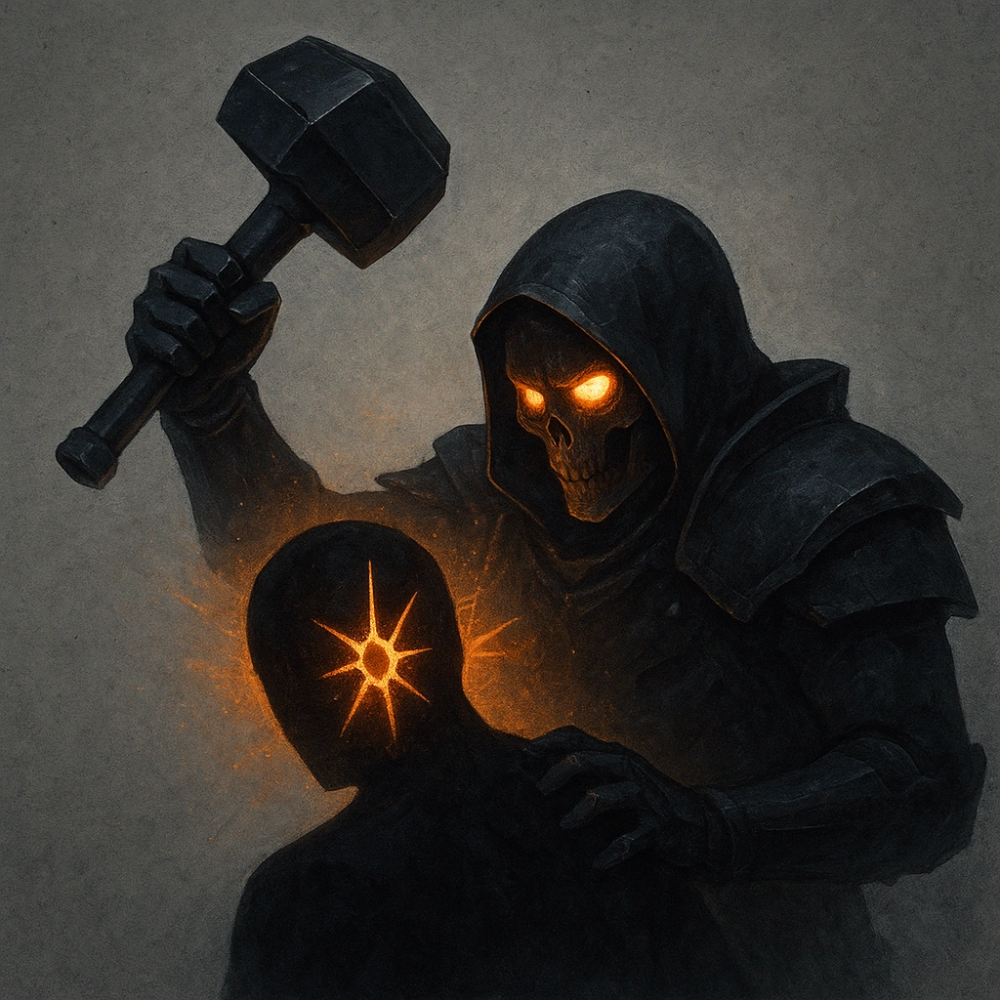

# Punish the Guilty

## Description
*
The Archer deals double damage to targets marked Guilty by a High Seraph.
*

## Actions
—

---

adversaries-features/Ranged
 
**UUID:** `Compendium.cybermancy.system.punish-the-guilty`

