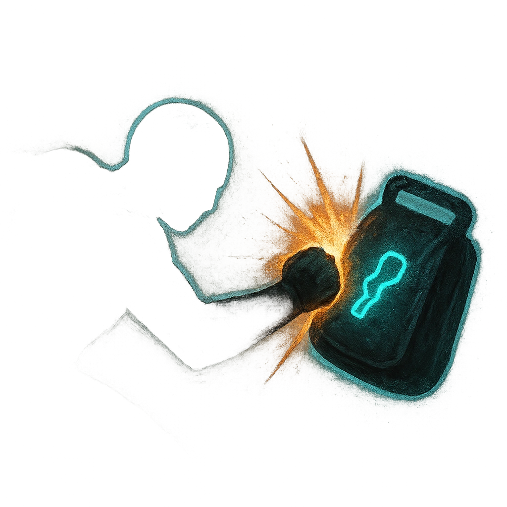

# Quick Hands

## Description
*
Make an attack against a target within Melee range. On a success, deal <strong>1d8+2</strong> physical damage and the Thief steals one item or consumable from the target’s inventory.
*

## Actions
- 
**Attack** *Make an attack against a target within Melee range. On a success, deal 1d8+2 physical damage and the Thief steals one item or consumable from the target’s inventory.*

---

adversaries-features/Skulk
 
**UUID:** `Compendium.cybermancy.system.quick-hands`

