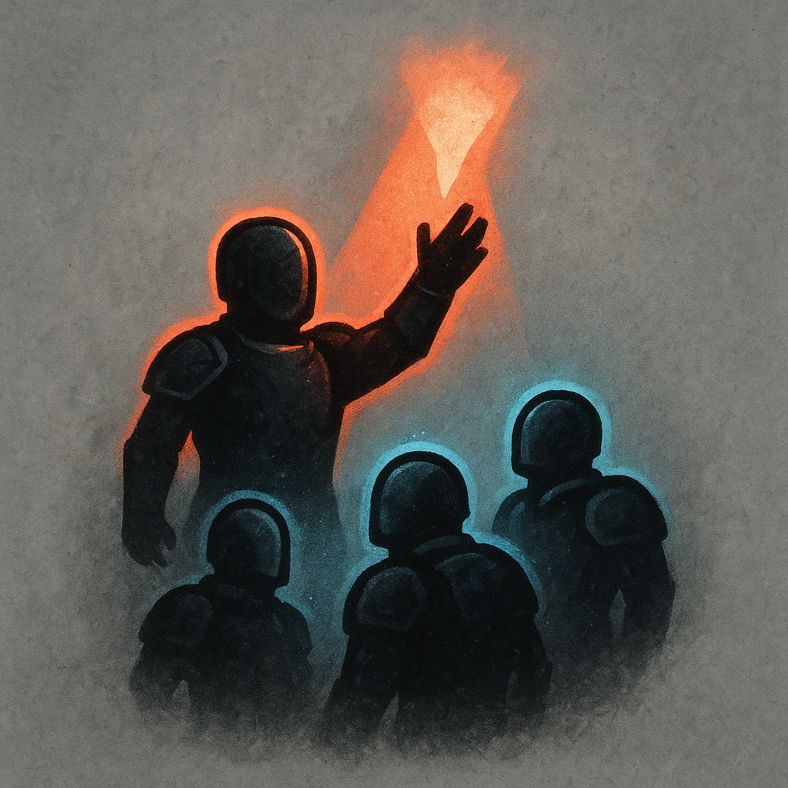

# Rally Guards

## Description
*
<strong>Spend 2 Fear</strong> to spotlight the Head Guard and up to <strong>2d4</strong> allies within Far range.

@Template[type:emanation|range:f]
*

## Actions
- 
**Rally** *f]*

---

adversaries-features/Leader
 
**UUID:** `Compendium.cybermancy.system.rally-guards`

