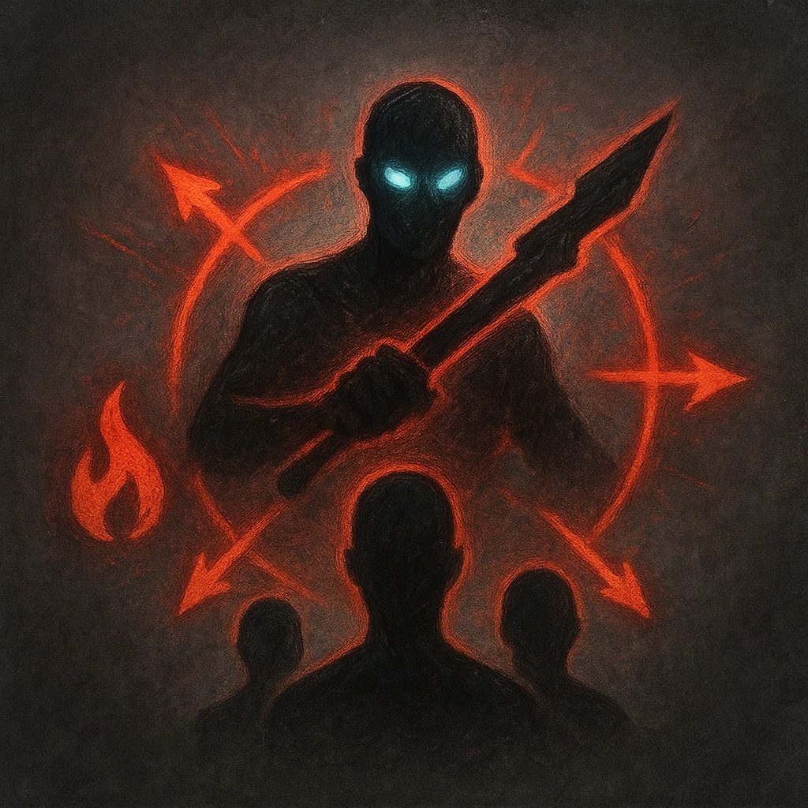

# Ramp Up

## Description
*
You must <strong>spend a Fear</strong> to spotlight the Ogre. While spotlighted, they can make their standard attack against all targets within range.
*

## Actions
- 
**Spend Fear** *You must spend a Fear to spotlight the Ogre. While spotlighted, they can make their standard attack against all targets within range.*

---

adversaries-features/Solo
 
**UUID:** `Compendium.cybermancy.system.ramp-up`

