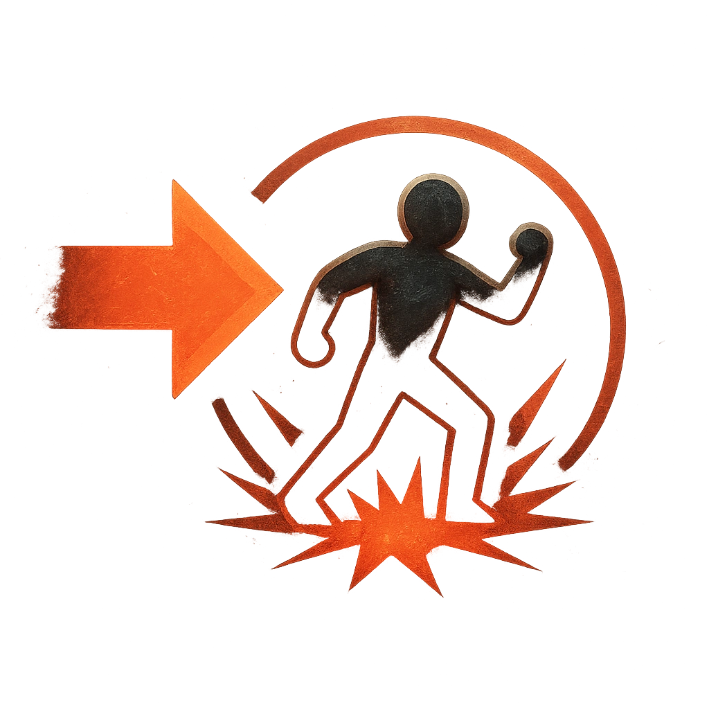

# Rampage

## Description
*
Countdown (Loop 1d6). When the Hunter is in the spotlight for the fi rst time, activate the countdown. When it triggers, move the Hunter in a straight line to a point within Far range and make an attack against all targets in their path. Targets the Hunter succeeds against take <strong>2d8+2</strong> physical damage.

@Template[type:ray|range:f]
*

## Actions
- 
**Countdown** *Countdown (Loop 1d6). When the Hunter is in the spotlight for the first time, activate the countdown.*

- 
**Attack** *f]*

---

adversaries-features/Leader
 
**UUID:** `Compendium.cybermancy.system.rampage`

