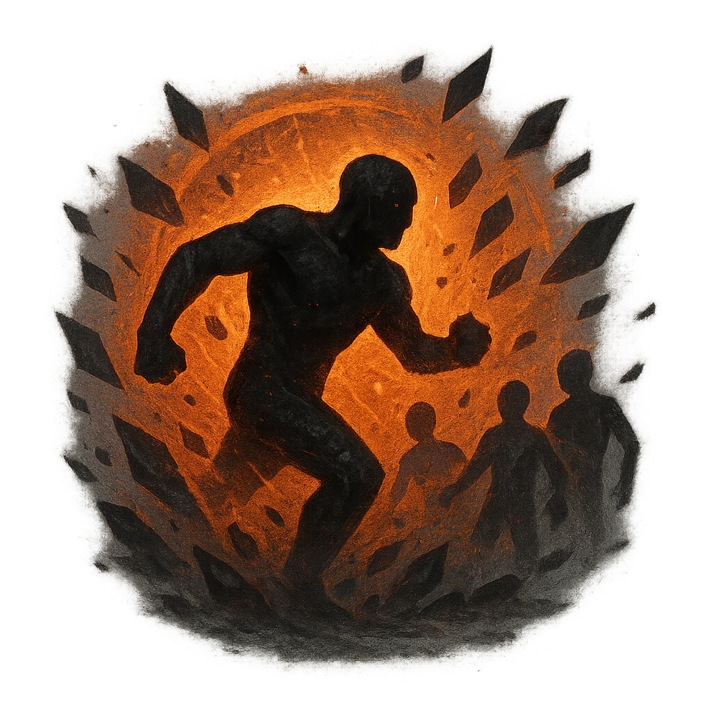

# Rampaging Fury

## Description
*
When the Ogre marks 2 or more HP, they can rampage. Move the Ogre to a point within Close range and deal <strong>2d6+3</strong> direct physical damage to all targets in their path.
*

## Actions
- 
**Damage** *When the Ogre marks 2 or more HP, they can rampage. Move the Ogre to a point within Close range and deal 2d6+3 direct physical damage to all targets in their path.*

---

adversaries-features/Solo
 
**UUID:** `Compendium.cybermancy.system.rampaging-fury`

