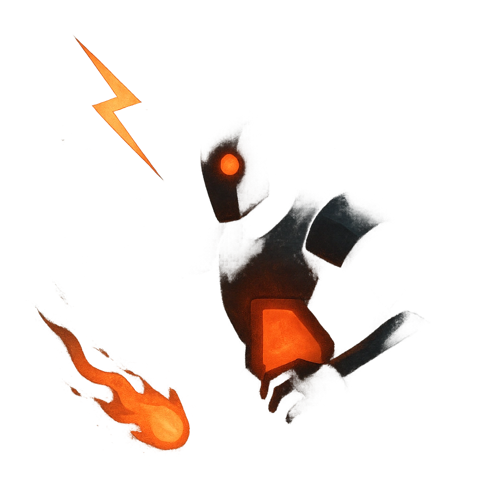

# Randomized Tactics

## Description
*
Mark a Stress and roll a <strong>d6</strong>. The Box uses the corresponding move:
<ol><li>
<strong>Mana Beam</strong>
</li><li>
<strong>Fire Jets</strong>
</li><li>
<strong>Trample</strong>
</li><li>
<strong>Shocking Gas</strong>
</li><li>
<strong>Stunning Clap</strong>
</li><li>
<strong>Psionic Whine</strong>
</li></ol>*

## Actions
- 
**Roll d6** *Mana BeamFire JetsTrampleShocking GasStunning ClapPsionic Whine*

---

adversaries-features/Solo
 
**UUID:** `Compendium.cybermancy.system.randomized-tactics`

