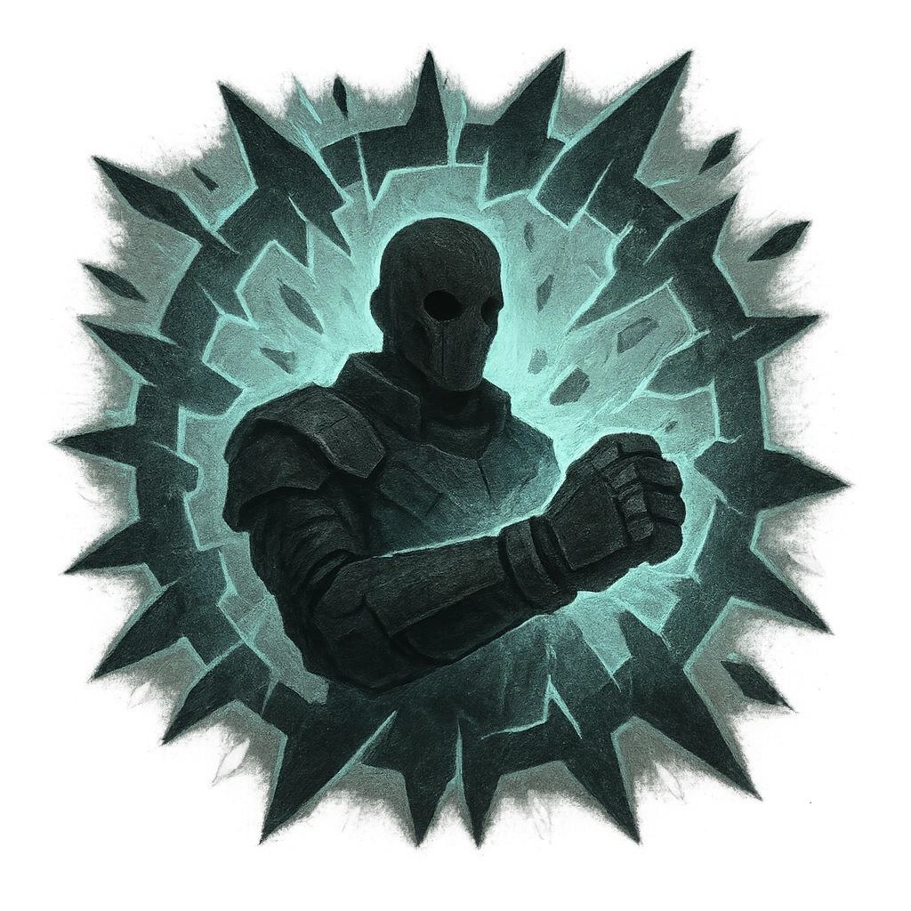

# Reality Quake

## Description
*
<strong>Spend a Fear</strong> to rattle the edges of reality within Far range of the Abomination. All targets within that area must succeed on a Knowledge Reaction Roll or become Unstuck from reality until the end of the scene. When an Unstuck target spends Hope or marks Armor Slots, HP, or Stress, they must double the amount spent or marked.

@Template[type:emanation|range:f]
*

## Actions
- 
**Roll Save** *f]*

---

adversaries-features/Bruiser
 
**UUID:** `Compendium.cybermancy.system.reality-quake`

