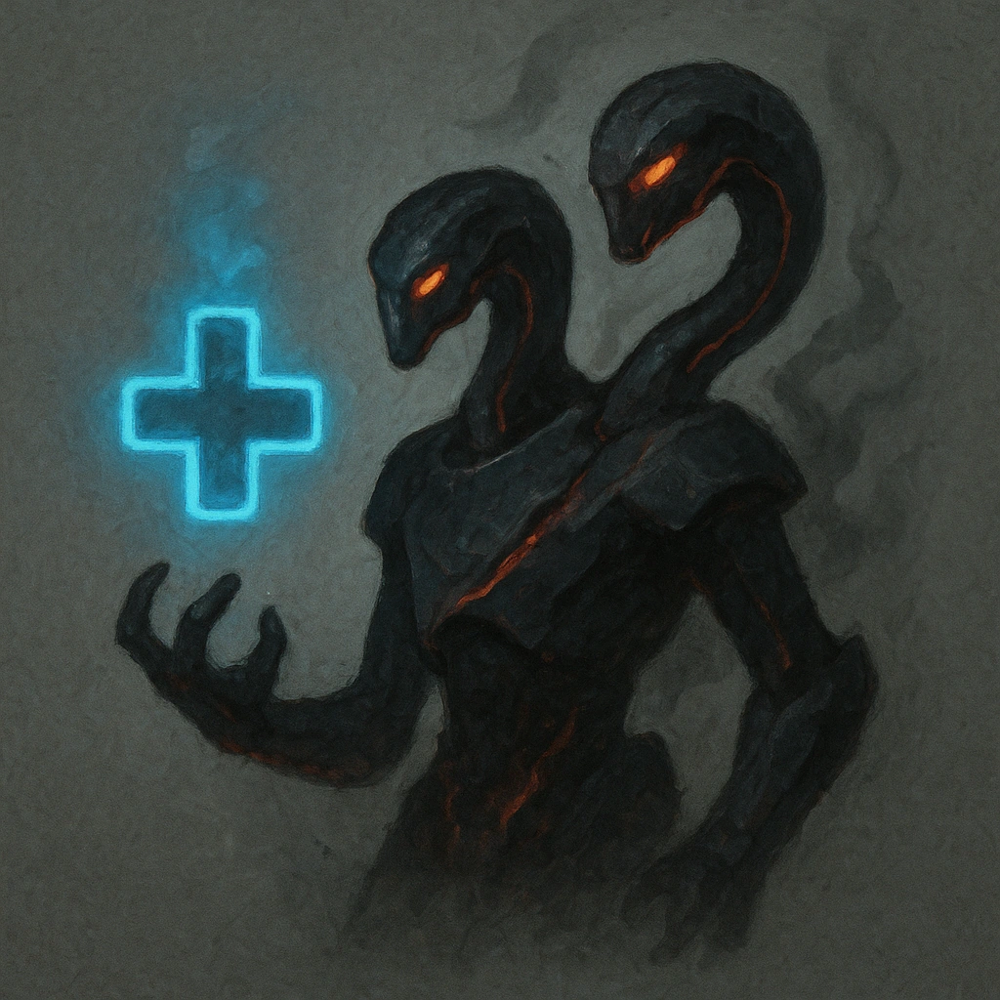

# Regeneration

## Description
*
If the Hydra has any marked HP, <strong>spend a Fear</strong> to clear a HP and grow two heads.
*

## Actions
- 
**Spend Fear** *If the Hydra has any marked HP, spend a Fear to clear a HP and grow two heads.*

---

adversaries-features/Solo
 
**UUID:** `Compendium.cybermancy.system.regeneration`

