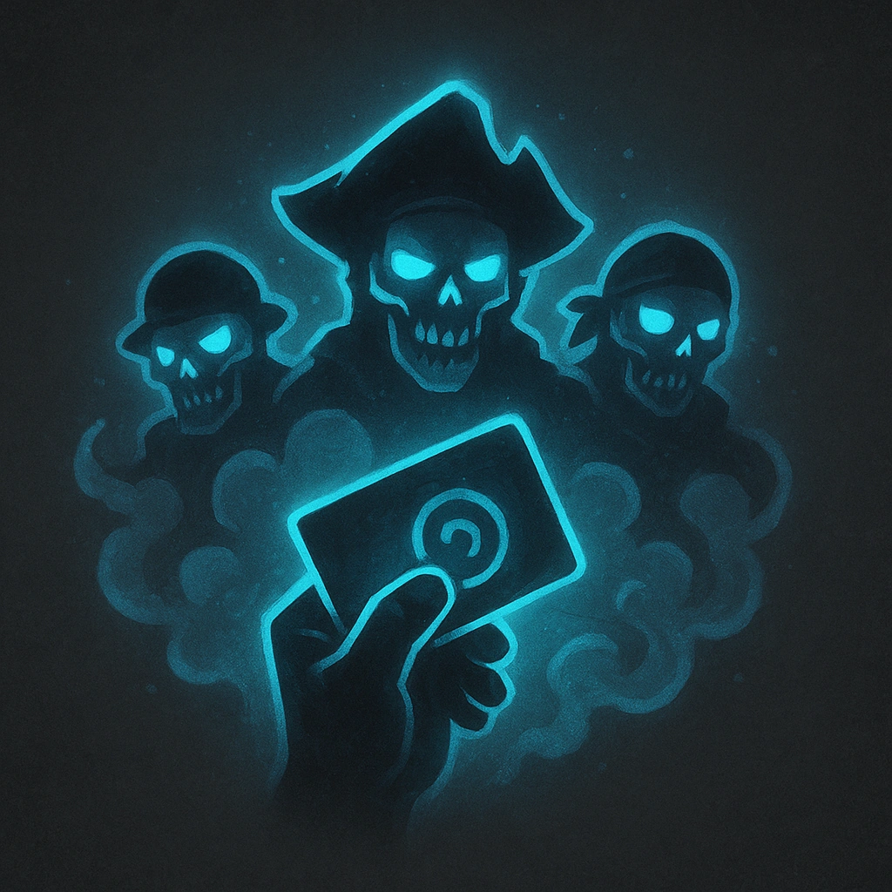

# Reinforcements

## Description
*
Once per scene, <strong>mark a Stress</strong> to summon a Pirate Raiders Horde, which appears at Far range.
*

## Actions
- 
**Mark Stress** *Once per scene, mark a Stress to summon a Pirate Raiders Horde, which appears at Far range.*

---

adversaries-features/Leader
 
**UUID:** `Compendium.cybermancy.system.reinforcements`

