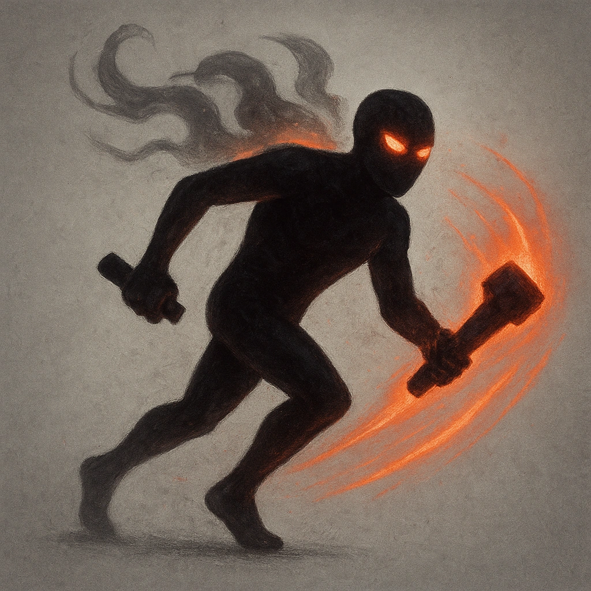

# Relentless (2)

## Description
*
The Legion can be spotlighted up to two times per GM turn. Spend Fear as usual to spotlight them.
*

## Actions
—

---

adversaries-features/Horde
 
**UUID:** `Compendium.cybermancy.system.relentless-2`

